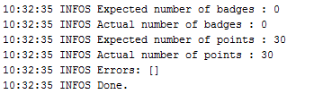
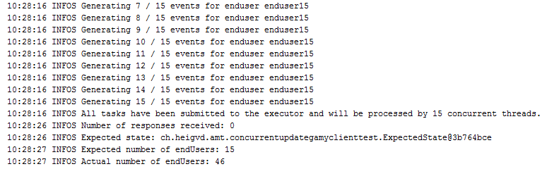
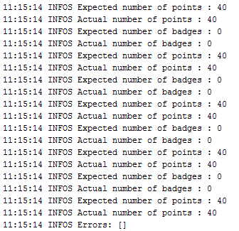

# Rapport de projet - Partie 2
Ceci est le rapport de la partie 2 du projet

# Introduction
Ce rapport concerne la partie 2 du projet de Gamification.

Il concerne la Gamification en elle-même, c'est à dire attribuer des points ou des badges (pour le moment) à des utilisateurs d'une application gamifiée, suite à la réception d'événements, par exemple poser une question ou poster un commentair, ou encore tirer sur un ennemi dans un jeu de guerre par exemple.

# Auteurs
<li>Raphaël Racine
<li>Parfait Plaisir de Pâques Noussibi
<li>Vanessa Michelle Meguep
<li>Samira Kouchali

# Modèles
## Nouvelles Entités créées
Voici les différentes entités que nous avons créées pour la gamification.

### Diagramme


### Explications
<li><b>Rule</b>

Cet entité représente une règle à appliquer lorsque un événement avec un certain type correspondant arrive (eventType).

Cette entité possède les attributs suivants :
<li>reason : C'est la raison pourquoi la règle s'applique
<li>conditions : C'est les conditions pour que la règle s'applique
<li>eventType : C'est le type d'événement auquel on applique cette règle

<b>Remarques sur les conditions</b>

Il est à noter que les conditions sont modélisées sous forme d'une Map<String, Object>.

Cette map doit être vide si la règle peut s'appliquer à chaque fois qu'un événement du type
eventType arrive (par exemple : A chaque fois que l'eventType est "Poser une question", alors on donne 5 points systèmatiquement)

Par contre si elle n'est pas vide, elle doit avoir la forme suivante :
<li>Clé : Nom d'une propriété de l'événement
<li>Valeur : Valeur que la propriété spécifiée doit avoir (<b>égalité</b>)

Par exemple si on a :
<li>"proprieteX" = 50
<li>"proprieteY = 80

Ceci signifiera que la règle sera appliquuée <b>uniquement</b> si ces deux propriétés existent
dans l'événement et qu'elle ont respectivement ces valeurs.

Appliquer une règle, ça signifie ici donner des points ou bien donner un badge à un EndUser.

<li><b>Award</b>

Cet entité représente le fait qu'un EndUser ait gagné une récompense suite à l'application d'une
règle lors de la réception d'un événement.

Ses attributs sont les suivants :
<li> reason : Raison pour laquelle l'utilisateur a remporté une récompense
<li> receptionDate : Date de réception de la récompense

<li><b>AwardPoint</b>

Cet entité représente le fait qu'un EndUser a gagné (ou perdu) des points.

Elle hérite de Award car elle possède aussi une raison et une date de réception.

Elle a un attribut supplémentaire qui est le nombre de points que l'utilisateur
a remporté (nbPoints)

<li><b>AwardBadge</b>

Cet entité représente le fait qu'un EndUSer a remporté un Badge.

Elle hérite de Award car elle possède aussi une raison et une date de réception.

<li><b>Action</b>

Cet entité représente une action à effectuer lorsqu'une règle peut être appliquée.

Elle permet de stocker pour une règle X donnée, le nombre de points à donner ou
bien le badge a donné au cas où la même règle X est appliquée.

<li><b>ActionAwardPoint</b>

Cet entité représente une action "Donner ou retirer des points".

Elle permet de stocker pour une règle X donnée, le nombre de points à donner ou retirer au cas où la même règle X est appliquée.

<li><b>ActionAwardBadge</b>

Cet entité représente une action "Donner un badge".

Elle permet de stocker pour une règle X donnée, le badge à donner au cas où la même règle X est appliquée.

<li><b>Badge</b>

Cet entité représente un badge d'une application. Chaque application définit ses propres badges.

Chaque badge possède un nom.

<li><b>Level</b>

Cet entité représente un niveau par rapport à un nombre de points. Elle possède deux attributs :

<li>minimumPoints : C'est le nombre de points minimum à avoir pour avoir ce niveau
<li>name : Le nom du niveau

# API REST
Voici ce que nous avons réalisé au niveau de l'API Rest de notre application.

## Préambule
Tout d'abord, il est à noter que dans la plupart des ressources de notre API Rest (respectivement les événements, badges, niveaux et règles) peuvent être envoyées ou reçues par le serveur uniquement si l'utilisateur de l'API Rest a spécifié l'API Key de l'application concernée.

Cette API Key est à spécifier dans l'entête Authorization de http.

Il est à noter que toutes les URL's de l'api commencent par /api.

Pour qu'on puisse accéder à l'API Rest, nous avons dû adapter la classe SecurityFilter afin de ne pas avoir besoin de s'authentifier. Par contre il faut spécifier l'API Key dans l'entête Authorization (on suppose que les utilisateurs ne connaissent pas les API-Key...)

Voici donc les différentes ressources de notre API Rest.

## Evénements
```
POST /api/events
Authorization: "Une API KEY (celle de l'application concernée)"

{
	"eventType": "Add question",
	"timestamp": "2015-01-31T18:00:00.000Z",
	"endUserNumber": "458GDFR",
	"properties": {
		"nbQuestions": 100
	}
}
```
Permet d'envoyer d'envoyer un événement dans l'application.

On doit spécifier :
<li>Type d'événement : Il s'agit du type de l'événement qui permet à notre serveur de pouvoir appliquer toutes les règles qui ont ce type d'événement.
<li>Date de l'événement : On doit spécifier la date à laquelle arrive l'événement (il faut que le format soit identique à celui de l'exemple) afin que dans le cas où une des règles s'applique et qu'elle donne une récompse à l'utilisateur spécifié, la date de réception de la récompense soit enregistrée.
<li>Numéro de l'utilisateur : Le numéro de l'utilisateur doit être spécifié afin de savoir à qui il faut donner un badge ou des points
<li>Propriétés de l'événement : Ces propriétés seront analysées par les règes qui s'applique à ce type d'événement. Dans le cas où ces propriétés "matchent" correctement dans une règle, alors la règle s'applique. Il est à noter que si la règle s'applique systèmatiquement (donc qu'elle n'a pas de conditions) alors les propriétés sont de l'événement sont ignorée et la règle s'applique quand même).

## Badges
```
GET /api/badges
Authorization: "Une API KEY (celle de l'application concernée)"
```
Permet d'obtenir tous les badges de l'application spécifiée.

```
POST /api/badges
Authorization: "Une API KEY (celle de l'application concernée)"

{
	name: "Warrior"
}
```
Permet d'ajouter un badge dans une application.

```
PUT /api/badges/{id}
Authorization: "Une API KEY (celle de l'application concernée)"

{
	name: "President of questions"
}
```

Permet de modifier un badge dans une application (en spécifiant son id dans l'url)

```
DELETE /api/badges/{id}
Authorization: "Une API KEY (celle de l'application concernée)"
```
Permet d'effacer un badge dans une application (en spécifiant son id dans l'url)

## Niveaux
```
GET /api/levels
Authorization: "Une API KEY (celle de l'application concernée)"
```
Permet d'obtenir tous les niveaux de l'application spécifiée.

```
POST /api/levels
Authorization: "Une API KEY (celle de l'application concernée)"

{
	name: "Soldat",
	minimumOfPoints: 0
}
```
Permet d'ajouter un niveau dans une application

```
PUT /api/levels/{id}
Authorization: "Une API KEY (celle de l'application concernée)"

{
	name: "Sergent",
	minimumOfPoints: 450
}
```

Permet de modifier un niveau dans une application (en spécifiant son id dans l'url)

```
DELETE /api/levels/{id}
Authorization: "Une API KEY (celle de l'application concernée)"
```
Permet d'effacer un niveau dans une application (en spécifiant son id dans l'url)

## Règles

```
GET /api/rules
Authorization: "Une API KEY (celle de l'application concernée)"
```
Permet d'obtenir la liste des règles de l'application concernée.

```
POST /api/rules
Authorization: "Une API KEY (celle de l'application concernée)"

{
	"conditionsToApply": {
		"nbQuestions": 100
	},
	"eventType": "Add question",
	"reason" : "100 questions posted",
	"awardType" : "AwardBadge",
	"awardValue" : 3	
}
```
Permet d'ajouter une nouvelle règle dans une application donnée.

On doit spécifier :
<li>Les conditions pour que la règle s'applique : La règle sera appliquée uniquement si les conditions "matchent" avec un événement qui aimerait appliquer cette règle (bien entendu le type de l'événement doit être le même)
<li>Type d'événement : C'est le type d'événement au quel on veut appliquer cette règle. Il est à noter qu'il peut y avoir plusieurs règles avec le même type d'événement.
<li>Raison : C'est la raison pour laquelle la règle s'applique (il est important de la spécifié car si cette règle est appliquée dans un événement, il faut se rappeler la raison pour laquelle elle s'applique afin que si on distribue une récompense, on sache pour quelle raison cette récompense a été remportée)
<li>Le type de récompense : Il s'agit ici de spécifier le type de récompense à distribuer (AwardBadge si on veut donner un badge ou bien AwardPoints si on veut donner ou retirer des points)
-Valeur de la récompense : Si le type de récompense est AwardBadge, il faut spécifier ici l'id du badge à distribuer. Si le type de récompense est AwardBadge, il faut spécifier ici le nombre de points à donner ou à retirer.

Malheureusement, par manque de temps, nous n'avons pas eu le temps d'implémenter la suppression et l'édition d'une règle.

# Services
Pour faire fonctionner notre projet de Gamification, nous avons donc mettre en oeuvre les services suivants :

## Package services
Ces services sont des managers permettant de faire des opérations sur plusieurs points de la Gamification :

<li>BadgesManager : Permet de faire des opérations sur les badges
<li>LevelsManager : Permet de faire des opérations sur les levels
<li>RulesManager : Permet de faire des opérations sur des règles

Le mieux est de consulter les commentaires des interfaces pour voir ce qu'ils offrent comme possibilités.

## Package services processors
Ces services permettent de processer des opérations venant de l'api rest.

Ils travaillent principalement avec les DTO de l'application (voir chapitre DTO)

<li>EventsProcessor : Permet de processer les événements à partir de l'API Rest
<li>BadgesProcessor : Permet de processer les badges à partir de l'API Rest
<li>LevelsProcessor : Permet de processer les levels à partir de l'API Rest
<li>RulesProcessor : Permet de processer les règles à partir de l'API Rest

Le mieux est de consulter les commentaires des interfaces pour voir ce qu'ils offrent comme possibilités.

Tous ces services implémentent l'interface <b>IGamificationDTOProcessor</b> afin de rendre le code un peu plus générique.

# Vues (Widgets)
Nous avons décider d'utiliser angularjs pour afficher les widgets. Dans un premier temps nous nous sommes contentés de mettre sur pieds
tous les éléments qu'il faut pour afficher un graphe dans angularjs avec la librairie chart, et naviger avec ui-router. 
<li> chart: qui permet de dessiner les graphs.
<li> ui-router: qui permet d'effectuer le routage côté client. 
<li> angular.js
<li> angular-chart.js
<li> ...

Par la suite, nous avons mis des données codées en dure pour tester le bon fonctionnement, et enfin  nous avons implémenté les scripts
avec http de angularjs pour aller chercher les données (requêtes AJAX).

Comme nous utilisons ui-router, nous avons ajouté dans notre serveur un contrôleur nommé <b>WidgetsGamificationDemoController.java</b> qui est mappé sur l'URL : /demoWidgets?view=uneVue --> Si le paramètre view n'est pas spécifié, la page gamification_demo/index.jsp est envoyée, sinon on envoi la page JSP qui a le nom du paramètre view (donc si on met view=start, on aura la vue de start.jsp...).

## Comment ça marche ?
Une fois l'application lancée, il faut comment utiliser /generate pour générer une application possèdant l'API Key ABC-123.

Ensuite, il faut exécuter le script de tests (ou utiliser l'api rest pour poster des événements, en suivant la syntaxe décrite plus haut). 

Ensuite, il faut aller dans /demoWidgets. Sur cette page, on peut choisir l'utilsateur dont nous voulons afficher les statistiques et entrer l'API Key de l'application correspondante.

Lorsque l'apiKey et le endUser correspondent effectivement à des donnée juste, on peut naviguer entre 3 widgets avec ui-router : Badges, Levels, Points.

## Aperçu des 3 widgets

### Initialisation


### Badges


### Niveaux


### Points


# Transactions
Voici la manière dont nous avons gérer les transactions par rapport aux
événements.

## Problème constaté
Au début on a testé l’application avec un seul thread et on a constaté qu’il n’y a pas problème et tous passent bien et on n'a pas d'erreur.

### Résultat du test avec un thread



Puis on a testé avec 15 threads simultanés avec 30 d'utilisateurs et on remarque qu’il y a les conflits entre les résultats. L’application a créé 46 utilisateurs dans la base de donnée qui est faux ! 
Ça signifie que par exemple deux thread entre la méthode et les deux ne trouvent pas l’utilisateur donc les deux vont créer la même utilisateur deux fois dans la base de donnée.

### Résultat du test avec 15 thread simultanés sans transaction



## Résolution

Pour résoudre ce problème de concourant, étant donné qu’on a beaucoup écriture dans la base de donnée, on choisit la stratégie de pessimiste.
 Donc On verrouille application quand un évènement arrive et on vérifie que si utilisateur n’existe pas on va le créer, donc si d’autre évènement arrive en même temps, il doit attends qu’application déverrouiller et après si l’utilisateur n’existe pas il en créé. Grace à cette verrouillage on empêche de créer utilisateur plusieurs fois dans base de donne et donc tous les résultats sont corrects.  Ça vaut dire on a 30 utilisateur dans la base de donnée.

### Résultat du test avec 20 thread simultanés avec transaction pessimiste



## Remarque
Malheureusement, nous n'avons pas eu le temps de gérer les transactions
concernant la configuration des badges, niveaux et points. Nous avons donc uniquement mis en place la gestion des transactions uniquement pour la réception des événements.

# DTO
Voici les différents DTO que nous utilisons dans notre application afin de ne pas transmettre les entités dans leur intégralité :

<li><b>BadgeDTO</b>

Cette DTO permet de représenter un badge, elle possède simplement le nom du badge et son id.

<li><b>EndUserDTO</b>

Cette DTO permet de représenter un endUser, elle possède le numéro du endUser, l'apikey de l'application on il se trouve, le nombre de points qu'il a et l'ensemble des badges qu'il possède (BadgeDTO). Cette DTO est utilisée pour valider les tests qui sont fait dans le projet ConcurrentUpdageGamyClient.

<li><b>EventDTO</b>

Cette DTO est utilisée pour recevoir des événements des applications gamifiées.

Elle est caractérisée par le type d'événement, le numéro du EndUser concerné, une hashmap qui contient les propriétés de l'événement, et un timestamp qui est la date de réception de l'événement.

<li><b>LevelDTO</b>

Cette DTO permet de représenter un level, elle possède simplement le nom du niveau, le nombre minimum de points pour l'atteindre ainsi que son id.

<li><b>RuleDTO</b>

Cette DTO représente une règle pour une application. Elle possède notamment son id, les conditions pour appliquer la règle, sous forme d'une HashMap, le type d'événement concerné, la raison pour laquelle on applique la règle, le type de récompense (AwardBadge ou AwardPoints), et la valeur de la récompense (l'id du badge si la récompse est un badge, sinon le nombre de points à enlever ou a distribuer).

<li><b>StatsXXXDTO</b>

Ces trois DTO (StatsLevelsDTO, StatsPointsDTO, StatsBadgesDTO) permettent d'obtenir les statistiques sur les EndUser d'une application par rapport à leur récompenses (badges et points).


# Tests
<b><font color=red>Vanessa parler de cette partie</font></b>

## Programme client (Java)
<font color=red>A FAIRE</font>

## Comment exécuter les tests
<font color=red>A FAIRE</font>

# Problèmes connus
<li>Il est difficile actuellement de configurer les règles d'une application car nous avons remarqué (vers la fin de la partie 2) qu'on aurait pu utiliser la Reflection pour pouvoir spécifier l'action a appliquer si la règle s'applique lorsque le serveur recoit un événement. Au vu du fait que nous ne l'avons pas fait par manque de temps, nous devons utiliser des instances of à certains endroits, ce qui est mauvais.
<li>La gestion des transactions concernent uniquement la réception des événements, et pas la configuration des applications (badges, levels et points)

# Conclusion
Nous avons rencontré quelques difficultés au niveau de l'applications des règles car au début nous avons eu pas mal de peine à se mettre d'accord sur le fonctionnement et ceci nous a fait perdre un peu de temps, ce qui nous a empêché de se concentrer sur la Reflection par exemple pour les règles.

Sinon, nous sommes satisfait de notre résultat même si le code présentent quelques lacunes au niveaux des règles.

Aussi, nous n'avons pas crée de classe Reputaion car nous avons décidé de simplifier le problème, mais il est évident que dans une vraie application nous l'aurions fait, pour des raisons d'extensibilité. Il est à noter que le proffesseur Monsieur Olivier Liechti nous a dit qu'il n'était pas obligatoire d'implémenter exactement le modèle qu'il présentait dans les slides.


