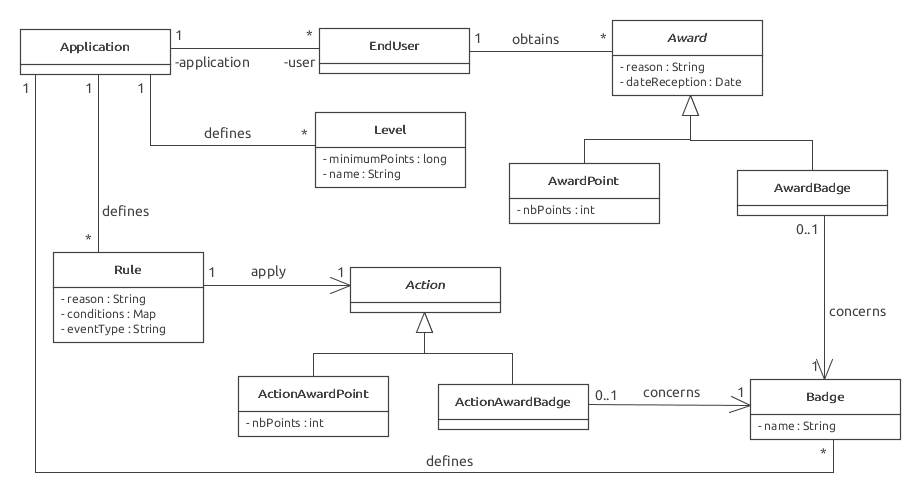

# Rapport de projet - Partie 2
Ceci est le rapport de la partie 2 du projet

# Introduction
<font color=red>A FAIRE</font>

# Auteurs
<li>Raphaël Racine
<li>Parfait Plaisir de Pâques Noussibi
<li>Vanessa Michelle Meguep
<li>Samira Kouchali

# Specifications
<font color=red>A FAIRE</font>

# Modèles
## Nouvelles Entités créées
Voici les différentes entités que nous avons créées pour la gamification.

### Diagramme


### Explications
<li><b>Rule</b>

Cet entité représente une règle à appliquer lorsque un événement avec un certain type correspondant arrive (eventType).

Cette entité possède les attributs suivants :
<li>reason : C'est la raison pourquoi la règle s'applique
<li>conditions : C'est les conditions pour que la règle s'applique
<li>eventType : C'est le type d'événement auquel on applique cette règle

<b>Remarques sur les conditions</b>

Il est à noter que les conditions sont modélisées sous forme d'une Map<String, Object>.

Cette map doit être vide si la règle peut s'appliquer à chaque fois qu'un événement du type
eventType arrive (par exemple : A chaque fois que l'eventType est "Poser une question", alors on donne 5 points systèmatiquement)

Par contre si elle n'est pas vide, elle doit avoir la forme suivante :
<li>Clé : Nom d'une propriété de l'événement
<li>Valeur : Valeur que la propriété spécifiée doit avoir (<b>égalité</b>)

Par exemple si on a :
<li>"proprieteX" = 50
<li>"proprieteY = 80

Ceci signifiera que la règle sera appliquuée <b>uniquement</b> si ces deux propriétés existent
dans l'événement et qu'elle ont respectivement ces valeurs.

Appliquer une règle, ça signifie ici donner des points ou bien donner un badge à un EndUser.

<li><b>Award</b>

Cet entité représente le fait qu'un EndUser ait gagné une récompense suite à l'application d'une
règle lors de la réception d'un événement.

Ses attributs sont les suivants :
<li> reason : Raison pour laquelle l'utilisateur a remporté une récompense
<li> receptionDate : Date de réception de la récompense

<li><b>AwardPoint</b>

Cet entité représente le fait qu'un EndUser a gagné (ou perdu) des points.

Elle hérite de Award car elle possède aussi une raison et une date de réception.

Elle a un attribut supplémentaire qui est le nombre de points que l'utilisateur
a remporté (nbPoints)

<li><b>AwardBadge</b>

Cet entité représente le fait qu'un EndUSer a remporté un Badge.

Elle hérite de Award car elle possède aussi une raison et une date de réception.

<li><b>Action</b>

Cet entité représente une action à effectuer lorsqu'une règle peut être appliquée.

Elle permet de stocker pour une règle X donnée, le nombre de points à donner ou
bien le badge a donné au cas où la même règle X est appliquée.

<li><b>ActionAwardPoint</b>

Cet entité représente une action "Donner ou retirer des points".

Elle permet de stocker pour une règle X donnée, le nombre de points à donner ou retirer au cas où la même règle X est appliquée.

<li><b>ActionAwardBadge</b>

Cet entité représente une action "Donner un badge".

Elle permet de stocker pour une règle X donnée, le badge à donner au cas où la même règle X est appliquée.

<li><b>Badge</b>

Cet entité représente un badge d'une application. Chaque application définit ses propres badges.

Chaque badge possède un nom.

<li><b>Level</b>

Cet entité représente un niveau par rapport à un nombre de points. Elle possède deux attributs :

<li>minimumPoints : C'est le nombre de points minimum à avoir pour avoir ce niveau
<li>name : Le nom du niveau

# API REST
Voici ce que nous avons réalisé au niveau de l'API Rest de notre application.

## Préambule
Tout d'abord, il est à noter que dans la plupart des ressources de notre API Rest (respectivement les événements, badges, niveaux et règles) peuvent être envoyées ou reçues par le serveur uniquement si l'utilisateur de l'API Rest a spécifié l'API Key de l'application concernée.

Cette API Key est à spécifier dans l'entête Authorization de http.

Il est à noter que toutes les URL's de l'api commencent par /api.

Pour qu'on puisse accéder à l'API Rest, nous avons dû adapter la classe SecurityFilter afin de ne pas avoir besoin de s'authentifier. Par contre il faut spécifier l'API Key dans l'entête Authorization (on suppose que les utilisateurs ne connaissent pas les API-Key...)

Voici donc les différentes ressources de notre API Rest.

## Evénements
```
POST /api/events
{
	"eventType": "Add question",
	"timestamp": "2015-01-31T18:00:00.000Z",
	"endUserNumber": "458GDFR",
	"properties": {
		"nbQuestions": 100
	}
}
```

## Badges

<font color=red>A FAIRE</font>

## Niveaux

<font color=red>A FAIRE</font>

## Points

<font color=red>A FAIRE</font>

## Règles

<font color=red>A FAIRE</font>

# Controleurs
Voici une description des nouveaux contrôleurs.

<font color=red>A FAIRE</font>

# Services
Voici une description des nouveaux services.

<font color=red>A FAIRE</font>

# Vues (Widgets)
Voici une description des nouvelles vues.

<font color=red>A FAIRE</font>

# Transactions
Voici la manière dont nous avons gérer les transactions par rapport aux
événements.

<font color=red>A FAIRE</font>

Malheureusement, nous n'avons pas eu le temps de gérer les transactions
concernant la configuration des badges, niveaux et points.

# DTO

# Tests
<b><font color=red>Vanessa parler de cette partie</font></b>

# Problèmes connus
<font color=red>A FAIRE</font>

# Conclusion
<font color=red>A FAIRE</font>


