# Rapport de projet - Partie 3
Ceci est le rapport de la partie 3 du projet

# Auteurs
<li>Raphaël Racine
<li>Parfait Plaisir de Pâques Noussibi
<li>Vanessa Michelle Meguep
<li>Samira Kouchali

# Introduction
Ce rapport concerne la partie 3 du projet de Gamification.

# Sujet choisi
Nous avons choisi comme sujet l'amélioration des performances et de la scalabilité concernant la réception des événements, autrement dit le sujet 1 proposé par le professeur.

# Tests JMeter
Pour tester les performances et la scalabilité, nous avons décidé d'utiliser JMeter et d'envoyer des requêtes HTTP sur l'API Rest recevant les événements.

Cette requête sera celle-ci :

<li> Une entête HTTP contentant les éléments Content-type et Authorization

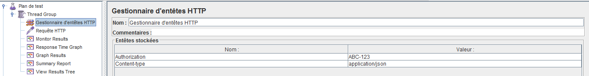

<li> L'événement qui sera envoyé

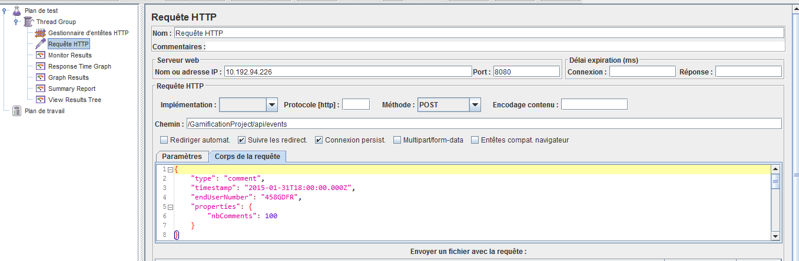

## Introduction
Nous avons décidé dans le script qui génère des données de tests (/generate) d'ajouter une centaine de règle sur une même application avec le même type d'événement (celui qui sera utilisé dans les requêtes HTTP lors de l'envoi de beaucoup d'événement à la fois avec JMeter), afin d'obliger le serveur a avoir un traitement non négligeable à faire, ce qui nous permettra de comparer plus facilement les temps de réponse entre le mode synchrone et le mode asynchrone (avec réponse directe du serveur).

## Test de l'annontation @Asynchronous
Tout d'abord, nous avons voulu vérifié le fonctionnement de l'annontation @Asynchronous qui <b>permet de répondre tout de suite au client</b> avant même que le serveur traite sa requête.

Cela permet d'éviter au client d'attendre que le traitement de sa requête (qui peut prendre du temps), se termine.

<b>Avantage :</b> Le client a tout de suite une réponse et n'attends pas.

<b>Inconvénient :</b> Si une erreur a eu lieu dans le traitement de la demande du client, il ne le saura pas à moins de questionner le serveur plus tard pour voir si cela c'est bien passé, mais il faut l'implémenter.

Pour que cette annotation fonctionne, il suffit de la placer au dessus de la méthode qu'on a envie de rendre asynchrone, c'est à partir de l'appel de cette méthode que le serveur répond au client et ensuite exécute la méthode en question.

Nous avons décider de placer cette annotation dans la méthode qui se trouve dans la classe <b>EventsProcessor.java</b> dans la méthode postDTO (autrement dit la méthode qui est appelée lors de la réception d'un événement).

### Vérification du fonctionnement
Pour vérifier que cette annotation fonctionne correctement, nous avons simulé cinq client avec JMeter et mesuré le temps de réponse en ayant mis un <b>Thread.sleep(10000);</b> dans la méthode en question (afin de simuler que le serveur travail).

Résultat du test en mode <b>synchrone</b>

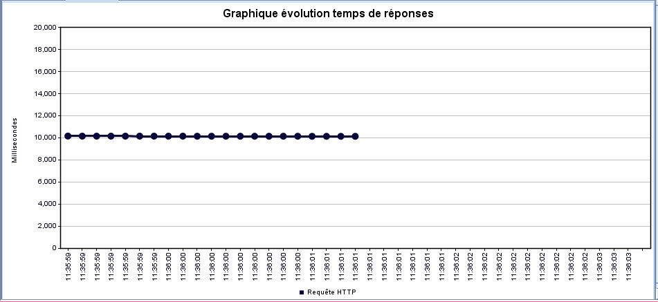

On voit clairement que le thread.sleep s'est effectué avant de renvoyer la réponse au client car le temps de réponse est de 10 secondes ici (10'000 millisecondes...)

Résultat du test en mode <b>asynchrone</b>

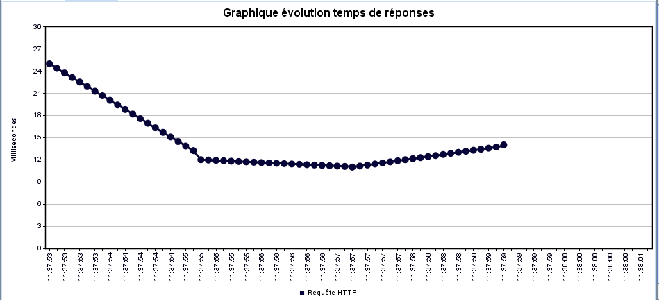

En mode asynchrone, cest tout le contraire, le serveur répond avant même d'avoir effectué le thread.sleep (qui a été fixé à 10 secondes), il est évident que le fonctionnement de l'annontation @Asynchrone fonctionne puisque si il ne fonctionnait pas le serveur aurait répondu au minimum 10 seconde après une requête, ce qui n'est pas le cas ici.

On est donc garantit que notre annotation fonctionne correctement.

Il est à noter que ce mode n'apporte pas de gain de performance au niveau de ce que le serveur doit effectuer comme travail à chaque événement (malgré le fait qu'il réponde tout de suite, il doit évidemment quand même effectuer tout le travail derrière, à savoir traiter toutes les règles de l'événement et communiquer avec la base de données). C'est juste que le client aura l'impression que le serveur traite sa demande plus rapidement, alors que c'est faux.

## Tests effectués sans amélioration
Voici les tests que nous avons effectuée sans avoir pour le moment apporté d'amélioration dans notre code de réception des événements (<b>sachant que le nombre de règles est de 100 pour le même type d'événement et la même application et qu'il faudra traiter 100 règles à chaque réception de cet événement</b>).

### Mode Synchrone
Ici, le mode synchrone est activé (donc pas d'annotation @Asynchronous) (le serveur ne répond pas tout de suite)

#### Test 1 - 100 utilisateurs avec un Thread Pool de 5
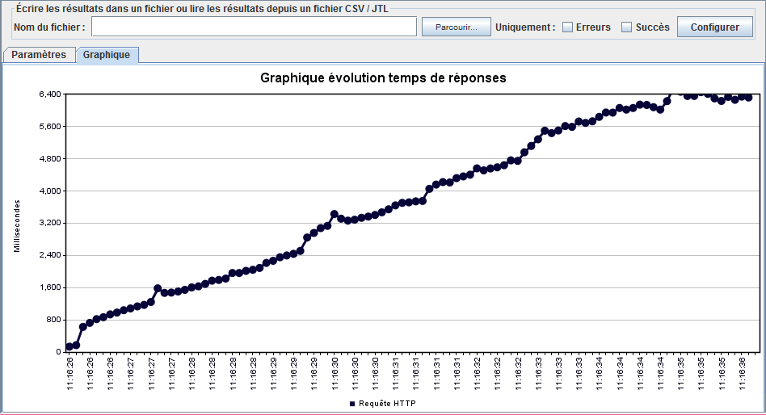

#### Test 2 - 100 utilisateurs avec un Thread Pool de 10
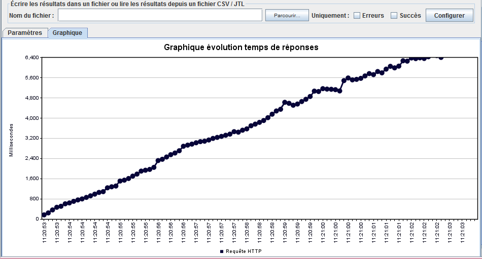

#### Test 3 - 100 utilisateurs avec un Thread Pool de 50
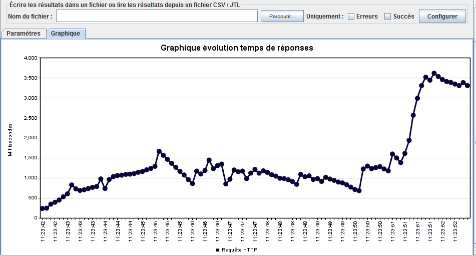

### Mode Asynchrone
Ici, le mode asynchrone est activé (le serveur répond tout de suite)

#### Test 4 - 100 utilisateurs avec un Thread Pool de 5
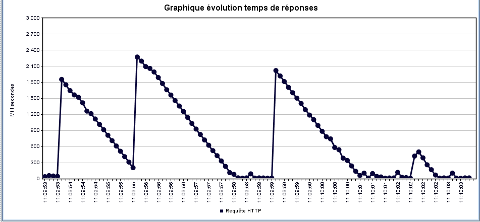

#### Test 5 - 100 utilisateurs avec un Thread Pool de 10
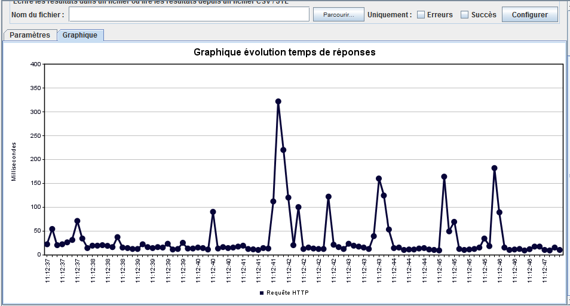

### Commentaires tests
A COMPLETER

## Ce qui pose des problèmes de performance
Voici les points qui peuvent potentiellement causer des pertes de performances dans notre algorithme de réception des événements :

<li> <b>Chargement de la liste de toutes les règles à chaque réception d'un événement</b> Donc si on a N règles pour le même type d'événement et la même application et qu'on reçoit M fois l'événement concerné, on devra faire M * N requêtes dans la base de données (pour charger quasiment à chaque fois les mêmes règles, si il n'y a pas eu de changement entre temps) et en plus on va charger N règles à chaque requête (donc énormément d'accès à la base de données).

<li><b>Verrouillage de l'application concernée lors de la réception d'un événement</b> En effet le système de verrous mis en place lors de la partie 2 ralentit de manière non négligeable le système car à chaque fois on va verrouiller toute l'application et en plus de manière inutile la plupart des cas.
 Ca veut dire que si pour une même application on recoit deux événement (un de type X et l'autre de type Y et que X a posé le verrou), Y devra quand même attendre même qu'il ne s'agit pas du même EndUser (on aurait du implémenter une contrainte UNIQUE dans l'entité EndUSer pour le couple (application, endUserNumber, voir chapitre Améliorations possibles)

<li><b>Grand nombre d'écritures dans la base de données lors de l'attributions des points</b> Si on imagine le cas où on envoi un événement dont 100 règles sont appliquées et que chacune donne des points, comme on fait un INSERT pour chaque règle validée, on va stocker 100 lignes dans la base de données (une pour chaque attribution de point). Cela ralentit également le système car faire 100 INSERT c'est assez long surtout si on a plusieurs client en même temps.

### Amélioration effectuée
Concernant les points mentionnés ci-dessus, nous n'avons pas malheureusement eu beaucoup de temps à notre disposition et nous avons donc travailler uniquement sur le chargement de la liste des règles lorsqu'on reçoit un événement.

Nous avons décider pour cela de mettre en place un système de cache pour toutes les règles de l'application afin d'éviter de les recharger à chaque fois et de perdre du temps inutilement.

Le fonctionnement reste cependant simple :

-Si on essaie de charger la liste des règles pour un événement et que le cache est vide, on remplit le cache avec toutes les règlse de l'application et ensuite on traite l'événement.

-Si il y a eu l'ajout d'une règle dans une application, le cache est simplement vidé, et il sera rechargé lors de la réception du prochain événment.

-Comme la modification et l'effacement d'une règles ne sont pas implémentés pour
 le moment, nous n'avons pas géré ces situations.

#### Tests effectués après amélioration
Voici les tests que nous avons effectuée après avoir mis en place le système de cache pour les règles (à savoir qu'il y a toujours 100 règles pour le même type d'événement et la même application).

##### Mode Synchrone
Ici, le mode synchrone est activé (donc pas d'annotation @Asynchronous) (le serveur ne répond pas tout de suite)

####### Test 1 - 100 utilisateurs avec un Thread Pool de 5
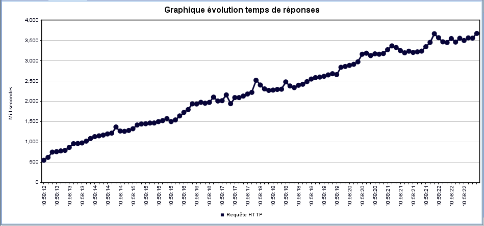

####### Test 2 - 100 utilisateurs avec un Thread Pool de 10
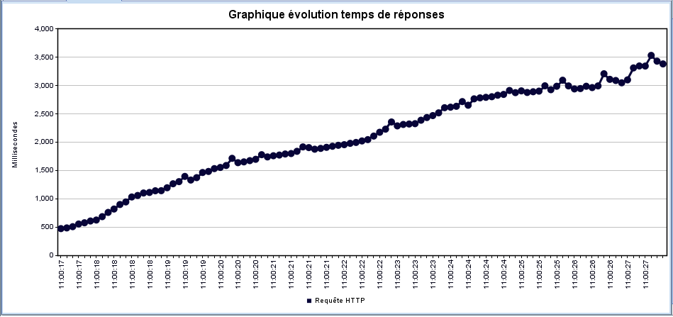

####### Test 3 - 100 utilisateurs avec un Thread Pool de 50
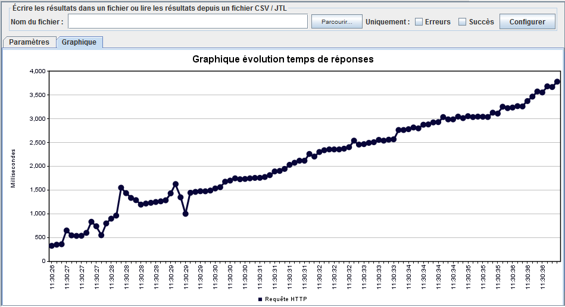

##### Mode Asynchrone
Ici, le mode asynchrone est activé (le serveur répond tout de suite)

###### Test 4 - 100 utilisateurs avec un Thread Pool de 5

###### Test 5 - 100 utilisateurs avec un Thread Pool de 10
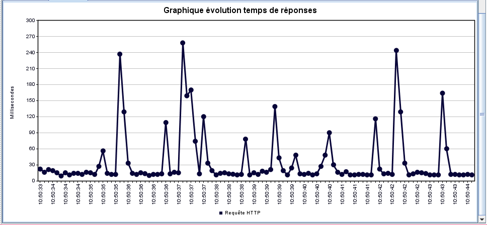

##### Commentaires tests
A COMPLETER

# Améliorations futures possibles
<li>Plutôt que de stocker une ligne dans la base de données pour chaque attribution de points (1 ligne par règle appliquée donc si on a 1 événement qui possède 100 règles et qu'elles sont toutes appliquées et qu'elles donnent toutes des points, <b>on va stocker 100 lignes !</b> donc questionner 100 fois la base de donées pour faire des INSERT...). Il serait plus judicieux que pour chaque règle appliquée donnant des points, on calcule le total des points attribués et à ce moment là on stockerait qu'une seul ligne avec le nombre total de points données. Ceci impliquerait potentiellement beaucoup moins d'INSERT et donc un gain de performances au niveau du serveur mais aussi en terme de place disponible dans la base de données.

<li>Mettre un cache de règle par application. Pour l'instant, notre cache de règles concerne <b>toutes les applications</b>. Il serait plus judicieux de mettre un cache pour chaque application afin d'éviter que si une application doit recharger la liste des règles dans le cache, elle ne charge pas celle des autres applications pour rien alors que ces dernières n'ont peut être pas modifiés leur règle... Autrement dit lors du chargement des règles dans le cache, on chargerait seulement celles qui concernent uniquement cette application (on aura aussi moins de données transférée depuis le serveur MySQL jusqu'au serveur Glassfish), par contre il y aura plusieurs cache à charger en mémoire et donc potentiellement un plus grand nombre de requêtes (puisqu'on ne charge pas toutes les règles d'un coup, d'autres seront chargées plus tard).

<li>Essayer d'améliorer la gestion des transactions lors de la réception d'événement en plaçant une contrainte UNIQUE pour le couple (Application, NoEndUser) dans l'entité EndUser, afin d'éviter de verrouiller toute l'application, mais de profiter de faire par exemple un UPSERT ou bien profiter d'une exception du genre "UniqueConstraintViolation" pour éviter de poser des verrous explicites à chaque fois, souvent de manière inutile (car rappelons le cela induit des pertes de performances non négligeables).

# Conclusion
Nous nous somme rendus compte lors de l'avancement dans la partie 3 que nous avons choisi un sujet assez difficile car l'amélioration des performances d'un système ne se fait pas en un claquement de doigt.

En effet, il difficile de prendre en compte beaucoup de facteurs en même temps et éviter d'apporter des améliorations qui vont elle même apporter des bugs fonctionnels.

Nous avons donc rencontrés pas mal de difficultés pour la réalisation de cette partie et nous n'avons malheureusement pas eu le temps d'améliorer entièrement l'algorithme de réception des événements.