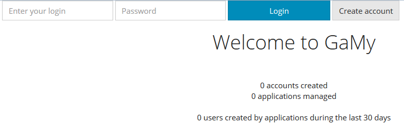
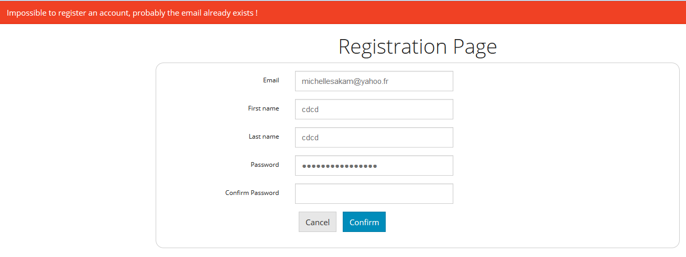
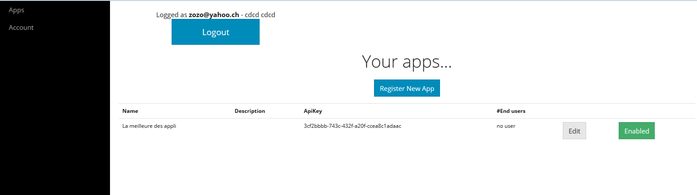
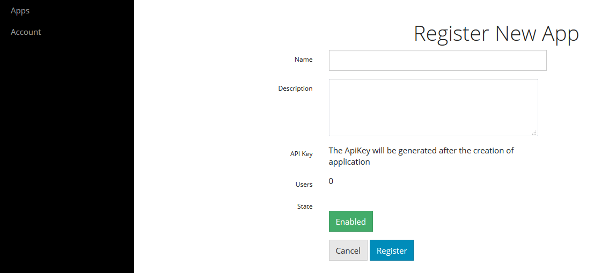
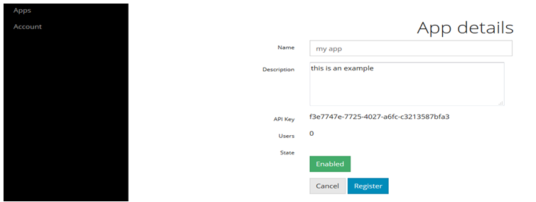
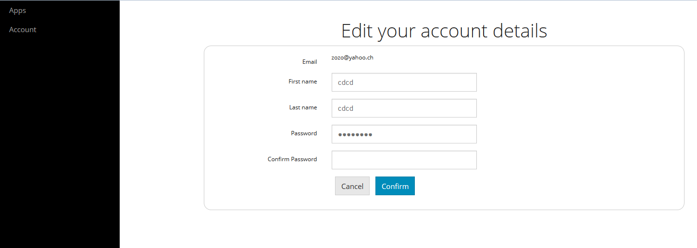

# Rapport de projet

<font color=red size=35>RESTE A FAIRE
Diagramme de classes sans les méthodes
Commenter classes modèles et formulaires
Intégrer les tests et les vues</font>

## Informations administratives

### Equipe

Raphaël Racine | raphaelracine | Project Owner - Services et contrôleurs

Samira Kouchali | SamiraKouchali | Partie tests

Vanessa Michelle Meguep Sakam | michellesakam | Vues (UI)

Parfait plaisir de Pâques Noubissi | NOUBISSI | Base de données et modèles

### Tâches réalisées par les membres du groupe

####Raphaël Racine

26.09.2015

<li> Redéfinir la structure du projet (notamment au niveau des pages)

En collaboration avec Samira Kouchali (les autres ayant un travail en dehors des cours)
<li>Création des vues principales pour le projet (seulement les fichiers jsp)
<li>Création d'un contrôleur (servlet) pour chacune de ces vues
<li>Création d'un contrôleur qui permet le login et le logout (AuthenticationServlet)
<li>Création d'un filtre qui permet de vérifier pour certaines pages qu'il y aie
    un utilisateur connecté

29.09.2015
<li>Scéance de discussion avec les membres du groupe

En collaboration avec Parfait plaisir de Pâques :
<li>Commencement de la réalisation des entités JPA

02.10.2015
<li>Résolution d'un bug lié au manque de la balise <base href="..."> qui posait
des problèmes CSS et des problèmes de redirection

03.10.2015
<li>Création d'un compte possible
<li>Alignement correcte du formulaire du login (sauf le bouton créer un compte)
<li>Début de l'implémentation des services DAO

05.10.2015

En collaboration avec Vanessa :
<li>Affichage du nombre de enduser inscrit les 30 derniers jours (page Welcome)

12.10.2015
<li>Création d'un fichier JSP pour afficher des erreurs (ce fichier est inclus dans header.jsp)

16.10.2015
<li>Avancement de la classe de génération de données de tests pour la persistence (TestDataManager.java)

17.10.2015
<li>Il est maintenant possible de créer une application et de lui assigner un Account, la clé de l'application est générée à ce moment là
<li>Restruction des services au niveau des requêtes SQL (elle ont été déplacées dans les classes modèles pour créer des requêtes nommées)
<li>Implémentation de la création d'une application dans le controleur ApplicationRegistration.java
<li>Reprise des données dans les formulaires en cas d'erreurs de saisie (Application et Account registration)

20.10.2015
<li>Injection des DAO dans les contrôleurs
<li>Utilisation de GenericDAO dans les DAO (en collaboration avec Parfait)
<li>Adaptation des modèles avec la classe AbstractDomainModelEntity (classe de Olivier LIechti) (en collaboration avec Parfait)
<li>Implémentation du POST dans le contrôleur qui permet d'éditer un compte
et adaptation de la vue

23.10.2015
<li>Implémentation d'une méthode dans ApplicationsManager qui permet de lui ajouter un 
end-user
<li>Avancement des JSP (liste des applications de l'utilisateur courant et programmation des boutons)

24.10.2015
<li>Implémentation de la page JSP qui affiche les EndUSers de l'application (controleurs, services) et traitement de la pagination

25.10.2015
<li>Factorisation création compte et modification compte au niveau JSP

27.10.2015
<li>Ecriture du code pour mettre à jour une application et factorisation création application et édition application au niveau JSP

30.10.2015
<li>Mise en place d'une politique de mots de passe pour les comptes utilisateur
<li>Commencement de la documentation pour la partie 1

31.10.2015
<li>Refactoring et commentaires du code

####Samira Kouchali
26.09.2015

En collaboration avec Raphaël Racine 
<li> Redéfinir la structure du projet (notamment au niveau des pages)
<li>Création des vues principales pour le projet (seulement les fichiers jsp)
<li>Création d'un contrôleur (servlet) pour chacune de ces vues
<li>Création d'un contrôleur qui permet le login et le logout (AuthenticationServlet)
<li>Création d'un filtre qui permet de vérifier pour certaines pages qu'il y aie
    un utilisateur connecté

2.10.2015
<li> préparé un scénario simple pour vérifier les performances de l'application avec jmeter

9.10.2015
<li> préparé des tests de sélénium(fluentlénium) pour vérifier la fonctionnalité de la page d'accueil et login de l'application Web

<li> préparé un test de jmeter de comparer le temps de réponse de l'application dans plusieurs cas, en ce qui concerne la mise en œuvre de la "count" dans l'application

16.10.2015

En collaboration avec Raphaël Racine
<li>Avancement de la classe de génération de données de tests pour la persistence (TestDataManager.java)

<li>revoir et comprendre les lectures et les codes qui sont fournis par les autres membres du groupe

23.10.2015
<li> préparé des tests de sélénium(fluentlénium) pour vérifier la fonctionnalitéé de la page create un nouveau compte et create un nouveau l'application 

30.10.2015

<il>comprendre les codes et préparer des tests sur d'autre la fonctionnalité du projet comme edit information du compte et d'application...

<il>écrire le rapport sur la partie du test
 
####Parfait plaisir de Pâques Noubissi
29.09.2015
<li>Scéance de discussion avec les membres du groupe

<li>Commencement de la réalisation des entités JPA
03.10.2015
<li>creation des entités métier et implementation des annotations jpa
<li>Collaboration avec le professeur pour résoudre les bugs sur les annotations jpa

14.10.2015
<li>create et implementation des DTOs

20/21.10.2015
<li>Implementation des DTO de façon générique et collaboration avec racine pour résoudre les bug

26.10.2015
<li>séance de discution sur le sur l'état d'avance du projet 

####Vanessa Michelle Meguep Sakam

25.09.2015
<li> lecture du code du MVC demo

26.09.2015
<li> Création de la vue welcome.jsp sans affichage des données dynamiques(nombre d’accounts create etc.)

29.09.2015
<li>Scéance de discussion avec les membres du groupe
<li> Création de a vue « Registration »


02.10.2015
<li> resolution conflits git
<li> création de la vue «Register new App », « app details »
<li> Séance de discussion avec le prof et les autres membres du groupe

05.10.2015
En collaboration avec raphael:
<li>Affichage du nombre de enduser inscrit les 30 derniers jours (page Welcome)

06.10.2015
<li>Création « edit your “account details” et “your apps”

09.10.2015

<li> lecture du code du project
<li>Modification du code de la vue « register new app » pour l’affichage des champs APIKEY et users
<li> comment créer la barre de navigation verticale.Debut de l’implémentation

13.10.2015
<li> séance de discussion : decision d’introduire des fenêtres modales.
<li> debut de l’implémentation

16.10.2015
<li> code html pourri-> réorganisation du code.Ajout d’un fichier footer.jsp.
<li>soucis avec l’affichage de la fenêtre modale.Application avec la vue « your apps ».Lorsque l’utilisateur appuye sur le bouton register « register new app » celui-ci devrait ouvrir la fenêtre modale « register new app » dont le code de la fenêtre avait déjà été crée. Au lieu de cela, il inclus directement le code de la page « register new app » dans celle de « your app ».

## Introduction

Ce rapport présente notre projet de groupe à la HEIG-VD dans le cadre du cours Applications Multi-Tiers de Monsieur Olivier Liechti.

## Manuel utilisateur
Voici le manuel utilisateur de l'application

### Comment exécuter et accéder à l'application

Premièrement, il faut installer NetBeans avec l'extension Glassfish à partir de ce [lien](https://netbeans.org/downloads/) (prendre la colonne Java EE ou bien la colonne All)

Ensuite, il faut avoir un serveur MySQL avec une base de données vide appelée <b>projetamt</b> avec la configuration suivante :
<li>Nom d'utilisateur : root
<li>Mot de passe : toor
<li>Serveur : localhost
<li>Port : 3306

Ces paramètres peuvent être réglés dans le pool MySQL une fois qu'il aura été créer automatiquement par NetBeans à la compilation du projet.

Ensuite, il faut ouvrir dans NetBeans le projet qui se trouve dans le répertoire src et qui se nomme GamificationProject.

Il se peut que dans Glassfish il faille ajouter un JNDI dans le répertoire JDBC Resources nommé jdbc/projetamt et qui se connecte à un poll (nommé mysql_projetAMT_rootPool par exemple)

Démarrer le serveur glassfish et ensuite compiler le projet avec clean and build, et ensuite exécuter l'application du projet et si tout se passe bien la page de bienvenue s'affiche dans le navigateur.

L'application peut être accédée grâce à l'URL : [http://localhost:8080/GamificationProject](http://localhost:8080/GamificationProject)

### Comment utiliser l'application

Une fois l'application démarrée, vous arrivez sur la page d'acceuil.

Ensuite vous pouvez créer un compte en cliquant sur Create Account, saisir les informations du compte et valider.

Vous arrivez ensuite sur la page où il y a toutes les applications qui vous appartiennent. Au début la liste est vide.

Pour créer une nouvelle application, cliquez sur le bouton Register New App et entrez les informations (la clé de l'application sera générée après sa création) et choisissez aussi si elle est disponible ou non simplement en cliquant sur le bouton adéquat. Une fois que c'est fini, confirmez.

Vous êtes de retour dans la liste des applications et elle apparaît maintenant dans votre liste. Il est possible de changer son statut dynamiquement (activée ou désactivée) en cliquant sur le bouton adéquat.

Le bouton Edit permet d'éditer l'application pour changer ses propriétés.

Il a également le nombre d'utilisateurs finaux qui utilisent vos applications qui apparait dans la liste des applications. Si il y a au moins un utilisateur, il est possible de cliquer sur le chiffre qui apparait pour afficher la liste des utilisateurs finaux, et vous pouvez naviguez dans les pages dans le cas où il y en a beaucoup (pagination).

Le menu à gauche vous permet d'afficher la liste de vos applications (Apps) ou bien d'éditer votre compte (Account). Dans ce dernier cas, vous pouvez changer les proprietés de votre compte utilisateur (sauf l'adresse e-mail).

### Comment mettre à jour, compiler et déployer l'application

Editer les fichiers sources, ensuite recompiler et redémarrer l'application (attention la base de données est effacée lors du redéployement par défaut).

Pour éviter ceci : Modifier le fichier persistence.xml qui se trouve dans Other Sources/src/main/resources/META-INF/ et mettre la propriété Table Generation Strategy sur None.

### Comment exécuter les tests automatisés
Pour lancer les tests automatisés, il faut ouvrir le projet nommé GamificationProjectTest dans NetBeans, et le démarrer.

Attention : Pour que tous les tests fonctionnent, il faut que la base de données soit vide et ensuite il faut démarrer l'application et accéder à l'URL /generate qui va générer des données de test. Et ensuite lancer les tests.

Important : Pour relancer les tests, il faut a nouveau que la base de données soit vide et suivre la même procédure que précédemment.

Vous trouverez plus de détails un peu plus loin dans le chapitre [Tests](#testsChapter)


## Design
Voici une description de l'application

### Description du système
Le système permet de se connecter avec un compte utilisateur afin de gérer sa propre liste d'application et consulter la liste des utilisateurs finaux de ces applications.

Il s'agit d'une application Java EE qui peut être déployée sur un serveur certifié Java EE, comme par exemple Glassfish.

### Fonctionnalités du système
Avec ce système, il est possible actuellement de :

<li>S'enregistrer avec un compte pour gérer ses propres applications
<li>Modifier les informations du compte
<li>Créer une nouvelle application qui aura une clé de licence auto-attribuée
<li>Modifier une application (nom, description, état)
<li>Activer ou désactiver une application
<li>Consulter la liste des utilisateurs finaux d'une application

### Interface utilisateur

Cette partie présente les différentes vues crées dans notre application et une description détaillée des différentes actions qui peuvent y être appliquées.

#### Page d'accueil (welcome page)



Cette page représente la page principale de l'application.

L'utilisateur y accède directement lorsqu'il lance l'application.Elle lui permet de se *logger* en entrant un *login* et un *password* existant et d'accéder ainsi à la page de ses applications "your apps" en cliquant sur le bouton "Login"ou de créer un compte en cliquant sur le bouton "create account".Cette page affiche également les informations suivantes: 
<li>Le message de bienvenu avec le nom de l'application(Welcome to GaMy),
<li>Le nombre de comptes crées,
<li>Le nombre d'applications managées,
<li>Le nombre d'utilisateurs crées par les applications il  y a un nombre de temps donné.

#### Créer un compte utilisateur(Create account)
 


Cette page permet à l'utilisateur de créer un compte utilisateur.L'utilisateur y accède en cliquant sur le bouton "Create account " de la page d'accueil.
Cette page comprend un formulaire que l'utilisateur doit compléter afin de créer son compte.Celui-ci doit notamment indiquer: 
<li>Un e-mail valide et pas encore utilisé par un autre utilisateur; sinon un message d'erreur est affiché pour lui indiquant que ce email est déjà utilisé afin qu'il en choisisse un autre
<li>un nom et prénom,
<li>un mot de passe d'au moins 8 caractères alpha-numérique qui doit confirmer en répétant le mot de passe
 
Les boutons "cancel" et "register" permettent respectivement de supprimer le formulaire rempli ci-dessus en retournant à la page de *login*  et d'enrégistrer le formulaire en ajoutant le compte nouvellement crée à la base de donnée.Une fois le compte crée ,l'utilisateur est automatiquement dirigé vers la page des applications "your apps"

#### Les applications d'un utilisateur(Your apps)
 


Cette page permet d'afficher les applications crées par un utilisateur.L'utilisateur y accède directement après s'être *logger* dans la page de connexion ou après la création d'un compte. Cette page comme d'autres pages ( l'utilisateur ne peut y accéder directement au travers de l'URL) comprend un barre de navigation sur la gauche qui permet d'accéder aux applications d'un utilisateur en cliquant sur "Apps" ou d'éditer un compte utilisateur en cliquant sur le bouton "Account". Elle comprend également les éléments suivants: 
<li>Dans l'entête de la page, les informations sur l'utilisateur connecté; son email, son nom et prénom.
<li>la liste des applications crées par l'utilisateur
<li>Un bouton "logout"qui permet à l'utilisateur de se déconnecter et de retourner à la page connexion.
<li>Un bouton "Register New App" qui permet de créer une nouvelle application.
Il est possible d'éditer chaque application apparaissant dans la liste des applications en cliquant sur le bouton "edit".Aussi, en cliquand sur le nombre d'utilisateurs de chaque application, il est possible d'avoir la liste des utilisateurs associés à cette application.

#### Enrégistrer une nouvelle application(register new app)
 


Cette page permet de créer une nouvelle application.L'utilisateur doit entrer un nom et une description à l'application.Une *api key * est générée et attribuée à la nouvelle application crée.Dans la page, il est également affiché le nombre d'utilisateurs associés à cette application ainsi que l'état de l'application(enabled ou disabled).En cliquant sur le bouton "cancel"l'utilisateur supprime toutes les informations entrées pour la création de la nouvelle application et retourne à la page des applications(your apps). Par contre, s'il clique sur le bouton "register" la nouvelle application est ajoutée à la liste de  ses applications et l'utilisateur est dirigé automatiquement à la page des applications(your apps).

####Page de details d'une application
 


Cette page permet d'éditer une application.L'utilisateur peut modifier le nom et la description de l'application, changer son état(enabled ou disabled). En cliquant sur le bouton "register", l'utilisateur enregistre ses modifications; sinon il  les supprime  en cliquant sur le bouton "cancel".

####Liste des utilisateurs associés à une application

<font size=36>A FAIRE !!!!</font>

####Edition d'un compte utilisateur
 

Cette page permet à un utilisateur d'éditer son compte.Celui-ci peut modifier son nom, prénom, mot de passe qu'il doit confirmer en le répétant. Un utilisateur ne peut  pas modifier son email. En cliquant sur le bouton "Confirm" l'utilisateur décide d'enregistrer ses modifications et "cancel" pour supprimer toutes ses modifications.


### API Rest
Les API Rest ne sont pas encore implémentées.

### Modèles de conception utilisés
L'application utilise les design pattern suivants pour le moment :

<li>MVC (Model - View - Controller)
<li>DAO (Data Access Object)


## Implémentation et architecture
Voici une description de l'implémentation actuelle de l'application.

### Structure des packages
Les packages ont été organisés de la manière suivante :

<li><b>controllers :</b> Ce package contient les contrôleurs de l'applications.

<li><b>controllers.ajax :</b> Ce package contient les contrôleurs qui permettent de traiter des requêtes Ajax

<li><b>filters :</b> Ce package contient les middlewares (filtres) de l'application

<li><b>model.entities :</b> Ce package contient les entités du modèle relationnel de l'application

<li><b>rest.dto :</b> Ce package contient les DTO (Data Transfert Object) (il concernera la prochaine partie du rapport)

<li><b>services :</b> Ce package contient les services de l'application

<li><b>services.dao :</b> Ce package contient les services DAO de l'application qui permettent d'accéder au modèle relationnel qui se trouve dans la base de données

<li><b>services.passwordvalidation :</b> Ce package contient les services permettant de vérifier qu'un mot de passe d'un compte utilisateur respecte la politique des mots de passe (par exemple le nombre de caractères doit être plus grand ou égal à 8...)

<li><b>forms :</b> Ce package contient des classes représentant des formulaires de saisie (afin de récupérer les données d'un formulaire et éventuellement les renvoyer)

<li><b>util :</b> Ce package contient des classes utiles à l'application

### Rôles des classes
Voici le rôles des différentes classes de l'application ainsi qu'une description de leur méthodes, regroupées par catégorie.

#### Servlets (contrôleurs)
<li><b>AccountServlet.java </b>

Ce contrôleur est mappé sur l'url :

```
/pages/account
```

Le rôle de cet URL est d'afficher la page qui permet de créer ou de modifier un compte utilisateur.

Si la méthode de la requête est GET, le paramètre nommé edit (qui est obligatoire et qui vaut true si on veut modifier un compte, et false si on veut créer un compte) permet de déterminer si on affiche la page pour créer un nouveau compte ou bien celle pour modifier un compte. Le fichier JSP qui est lié est "account_registration.jsp".

Si la méthode de la requête est POST, grâce au même paramètre edit on peut savoir si on est en train d'éditer ou de créer un compte (il est à noter que comme l'attribut method="PUT" n'existe pas dans la balise form de l'html, on doit spécifier dans le POST le paramètre edit (false ou true)).

Si on est en train d'éditer un compte, le controleur a une méthode privée create account qui s'occupe de récupérer les paramètres de la requête (ce que l'utilisateur a saisi) et même principe pour la modification d'un compte.

<li><b>ApplicationsServlet.java</b>

Ce contrôleur est mappé sur l'url :

```
/pages/application
```

Le rôle de cet URL est d'afficher la page qui permet de créer ou de modifier une application.

Si la méthode de la requête est GET, le paramètre nommé edit (qui est obligatoire et qui vaut true si on veut modifier une application, et false si on veut créer une application) permet de déterminer si on affiche la page pour créer une nouvelle application ou bien celle pour modifier une application. Le fichier JSP qui est lié est "application_registration.jsp".

Bien entendu pour éditer une application, il faut passer un autre paramètre nommé idApplication pour dire l'id de l'application à modifier.

Si une demande de modification de l'application est faite, le contrôleur vérifie que l'application appartient au compte actuellement connecté, sinon il refuse de modifier.

Si la méthode de la requête est POST, grâce au même paramètre edit on peut savoir si on est en train d'éditer ou de créer une application (il est à noter que comme l'attribut method="PUT" n'existe pas dans la balise form de l'html, on doit spécifier dans le POST le paramètre edit (false ou true)).

Si on est en train d'éditer une application, le controleur a une méthode privée createApplication qui s'occupe de récupérer les paramètres de la requête (ce que l'utilisateur a saisi) et même principe pour la modification.

<li><b>AuthenticationServlet.java</b>

Ce contrôleur est mappé sur l'url :

```
/auth
```

Ce contrôleur est du style "back-end" car il n'affiche pas de page, il permet à un utilisateur de s'authentifier avec un compte dans l'application.

Pour s'authentifier, il faut spécifier trois paramètres dans un POST :
<li>action (login pour s'authentifier, logout pour se déconnecter)
<li>email (email du compte utilisateur)
<li>password (le mot de passe de l'utilisateur)

Lors d'une action login, le controleur vérifie que le mot de passe et l'e-mail de l'utilisateur correspondent et si c'est le cas il créer une variable de session nommé "principal" qui contient le compte de l'utilisateur qui vient de se connecter.

Lors d'une action logout, le contrôleur détruit la variable de session nommée "principal".

<li><b>DataGeneratorServlet.java</b>

Ce contrôleur est mappé sur l'url :

```
/generate
```

Il permet de générer des données de tests (à condition que la base de données projetamt soit vide).

<li><b>ListApplicationsAccountServlet.java</b>

Ce contrôleur est mappé sur l'url :

```
/pages/yourApps
```

Ce contrôleur permet d'afficher la liste des applications de l'utilisateur actuellement connecté, il renvoie une vue générée par le fichier JSP nommé "applications_of_account.jsp".

<li><b>ListUsersApplicationServlet.java</b>

Ce contrôleur est mappé sur l'url :

```
/pages/listUsersApps
```

Il permet d'afficher la liste des utilisateurs finaux d'une application en paginant les résultats. La liste est paginée par le controleur à partir des paramètres de la requête suivants :
<li>currentNumPage : Le numéro de la page a afficher
<li>nbEndUsersPerPage : Le nombre d'utilisateurs finaux à afficher par page

Le contrôleur les valeurs de ces paramètres et les adapte le cas échéant (par exemple si le numéro de la page est trop grand et n'existe pas...

Par défaut, 10 utilisateurs finaux sont affichés dans une page et la première page est affichée, si les paramètres ne sont pas spécifiés.

Le controleur calcule la liste des utilisateurs finaux et les transmets à la vue nommée "list_user_of_application.jsp".

<li><b>WelcomeServlet.java</b>

Ce contrôleur est mappé sur l'url :

```
/pages/welcome
```

Il permet d'afficher la page d'acceuil du site nommé "welcome.jsp" et calcul le nombre d'utilisateurs finaux créées les 30 derniers jours (le nombre de jours peut être changé dans le contrôleur), le nombre d'applications qui sont managées par l'application, ainsi que le nombre de comptes existants et les affiche sur cette page.

<li><b>AjaxApplicationsServlet.java</b>

Ce contrôleur est mappé sur l'url :

```
/applicationsAjax
```

Il permet au client d'envoyer une requête de type POST ajax pour activer ou désactiver une application.

Pour activer une application, il faut mettre un paramètre action=enableApplication et un paramètre idApplicatino=id de l'application à modifier.

Pour désactiver une application, il faut mettre un paramètre action=disableApplication avec également l'id de l'application.

Ce contrôleur vérifie également que l'application appartient au compte actuellement connecté. 

#### Filtres

<li><b>SecurityFilter.java</b>

Ce filtre est mappé sur l'url :

```
/*  (n'importe laquelle)
```

Ce filtre permet de vérifier à partir de l'url demandée si la ressource demandée est protégée ou pas.

Si l'url est protégée, le filtre vérifie si un utilisateur est connecté grâce à la variable de session nommé "principal". Si c'est le cas, le filtre transmets la requête et la réponse au filtre / controleurs suivant et laisse le client accéder à la ressource demandée. Si ça n'est pas le cas, le filtre fait une redirection sur la page de bienvenue et ne créer pas de session.

Si l'url n'est pas protégée, le filtre ne fait rien et transmets simplement la requête.

#### Services

<li><b>AccountsManagerLocal.java</b>

Ce service est une interface qui permet de gérer les comptes utilisateurs notamment pour questionner la banque de données qui les concerne.

La classe AccountsManager.java implémente cet interface et elle fait appel à un service du type AccountDAOLocal pour les opérations de CRUD.

```
public void updateAccount(Account account) throws GamificationDomainEntityNotFoundException, BadPasswordException;
```

Cette méthode permet de mettre à jour un compte utilisateur.
Elle prend en paramètre le compte à modifier (qui doit posséder un id).

Elle renvoi une exception du type GamificationDomainEntityNotFoundException dans le cas où le compte utilisateur n'a pas été trouvée dans la base de données.

Elle renvoi une exception du type BadPasswordException si le nouveau mot de passe ne respecte pas la politique des mots de passe (voir classe PasswordPoliticValidator.java).

```
public void createAccount(Account account) throws BadPasswordException;
```

Cette méthode permet de créer un compte utilisateur.
Elle prend en paramètre le compte à créer.

Elle renvoi une exception du type BadPasswordException si le mot de passe ne respecte pas la politique des mots de passe.

```
public Account retrieveAccount(String email);
```

Cette méthode permet de récupérer un compte utilisateur a partir de son adresse e-mail (passée en paramètre).

Si le compte n'existe pas, la méthode renvoi null.

Cette méthode est utilisée par exemple dans AuthenticationServlet.java pour vérifier la connexion d'un utilisateur.

```
public long numbersOfAccount();
```

Cette méthode permet de récupérer le nombre de comptes existants.

<li><b>ApplicationsManagerLocal.java</b>

Ce service est une interface qui permet de gérer les applications notamment pour questionner la banque de données qui les concerne.

La classe ApplicationsManager.java implémente cet interface et elle fait appel à un service du type ApplicationDAOLocal pour les opérations de CRUD.

```
public void assignApplicationToAccount(Application application, Account account);
```

Cette méthode permet d'assigner un propriétaire à une application.
Elle prend en paramètre l'application et le propriétaire de l'application (l'objet account doit posséder un id).

Attention : L'application est créée également à ce moment là, et une ApiKey est générée automatiquement pour l'application.

```
public List<Application> applicationsOfAnAccountWithEndUsersNumber(Account account);
```

Cette méthode permet d'obtenir la liste des applications d'un compte et elle renvoi une liste d'application avec également le nombre d'utilisateurs finaux qui utilisent l'application. Elle est de la forme :
```[{application1, 34}, {application2, 102}, ...]```

```
public Application findById(Long id) throws GamificationDomainEntityNotFoundException;
```

Cette méthode permet de trouver une application à l'aide de son id.

Elle prend en paramètre l'id de l'application.

Elle renvoi une exception du type GamificationDomainEntityNotFoudException si l'application n'a pas été trouvée.


```
public long nbEndUsersOfApplication(Application application);
```

Cette méthode renvoi le nombre d'utilisateurs finaux d'une application. Si l'application n'existe pas, elle renvoi 0.


```
public void assignApplicationToAnEndUser(Application application, EndUser endUser);
```

Cette méthode permet d'inscrire un utilisateur final dans une application. L'application passée en paramètre doit être managée, mais pas le EndUser car il sera créer en même temps.


```
public void enableApplication(Application app) throws GamificationDomainEntityNotFoundException;
```

Cette méthode permet d'activer une application.

Elle renvoi une exception si l'application n'existe pas.

```
public void disableApplication(Application app) throws GamificationDomainEntityNotFoundException;
```

Cette méthode permet de désactiver une application.

Elle renvoi une exception si l'application n'existe pas.

```
    public List<EndUser> findEndUsersAndPaginate(Application app, int numPage, int nbEndUsersPerPage) throws GamificationDomainEntityNotFoundException;
```

Cette méthode permet d'obtenir la liste des utilisateurs finaux dans une version paginée, en spéciafiant le numéro de la page que l'on veut et le nombre d'utilisateurs finaux à afficher dans la page.

La pagination s'effectue au niveau de la base de données, pour des raisons de performances.

```
public void updateApplication(Application app) throws GamificationDomainEntityNotFoundException;
```

Cette méthode permet de mettre à jour une application.

Elle renvoi également une exception si l'application n'existe pas.

```
public boolean checkAccountIsOwnerOfApplication(Account account, Application application);
```

Cette méthode permet de savoir si un compte utilisateur est propriétaire d'une application.

Application et account doivent avoir un id et l'application doit être managée.

<li><b>EndUsersManagerLocal.java</b>

Ce service est une interface qui permet de gérer les utilisateurs finaux des applications notamment pour questionner la banque de données qui les concerne.

La classe EndUsersManager.java implémente cet interface et elle fait appel à un service du type EndUserDAOLocal pour les opérations de CRUD.

```
public long numberOfEndUsersCreatedDuringLastNbDays(int nbDays);
```

Cette méthode permet de compter le nombre d'utilisateurs finaux enregistrés depuis les nbDays derniers jours.

<li><b>TestDataManagerLocal.java</b>

Ce service permet de générer des données de tests.

La classe  TestDataManager implémente cette interface et se connecte aux services AccountsManager, ApplicationsManager pour créer des données de tests.

Ce service est appelé lorsque l'on accède à l'url /generate.

#### Entités


#### Formulaires


#### Classes utilitaires


### Diagramme de classes
Sera disponible prochainement.

### Aspects sélectionnés
Sera disponible prochainement

<div id="testsChapter"></div>
## Testing and validation

### Test strategy


Pour tester fonctionnement de l'application web avec fluentlénium: il faut d'aborde lancer et exécuter le projet pour démarrer le serveur, après pour générer les data il faut ajouter "/generate" in url. Maintenant on peut lancer le projet du test.

pour tester le performance du l'application avec jmater il faut faire la même chose. ca vaut dire lancez  le projet et générez les data avec url "/generate". Maintenant on peut commencer le test avec jmeter

Important: il faut lancer le programme du test juste une foie, car la modifications qu'on fait pendant du test , elles restent toujours dans la base de donne. Pour relancer le test il faut relancer l'application aussi afin que les données ne se trouvent plus dans la base de données.


### Tools

Les outils utilisés sont :
<li>JMeter --> Tests de performances (taux d'erreur, temps de réponse, graphiques)
<li>Fluentlenium --> Tests fonctionnels avec navigation automatique sur les pages de l'application

### Procedures


#### Tests Fluentlenium
<b>itShouldNotBePossibleToSigninWithAnInvalidEmail</b>

<b>But:</b> vérifier qu'il n'est pas possible de se loger avec un email invalide.


<b>Etapes :</b>

<li>Accéder à l'URL de base du projet
<li>Vérifier qu'on est sur la page d'acceuil
<li>L'utilisateur essaie de se connecter avec un email invalide et un mot de passe quelconque
<li>L'utilisateur appuie sur Login

<b>Résultat attendu</b> : L'utilisateur ne doit pas pouvoir se connecter et doit rester sur la page d'acceuil


****************************************

<b>itShouldBePossibleToSigninWithAnvalidEmail</b> 

<b>But:</b> qu'il est possible de se loger avec un email valide.


<b>Etapes :</b>

<li>Accéder à l'URL de base du projet
<li>Vérifier qu'on est sur la page d'acceuil
<li>L'utilisateur essaie de se connecter avec un email valide et un mot de passe valide 
<li>L'utilisateur appuie sur Login

<b>Résultat attendu</b> : L'utilisateur doit pouvoir se connecter et accéder à la page "Your Apps"

********************


<b>itShouldBeNotPossibleToAccessSecurePagesWithoutLogin</b>

<b>But:</b> vérifier qu'il n'est pas possible d'acceder a une page securité sans se logger


<b>Etapes :</b>
<li>Accéder diréctement à l'URL de la page sécurisé "Your Apps" 
 

<b>Résultat attendu</b> : L'utilisateur ne doit pas accéder à cette page et doit rester sur la page d'acceuil


***********************************************
<b>itShouldBePossibleToAccessRegistrationPagesWithClickSurCreateAccountButton()</b>

<b>But:</b> vérifier qu'il est possible d'accéder à la page enregistrement d'un compte avec bouton "Create Account" 

<b>Etapes :</b>

<li>Accéder à l'URL de base du projet
<li>L'utilisateur appuie sur CreateAccount

<b>Résultat attendu</b> :L'utilisateur doit accéder à la page enregistrement un account

*********************************************

<b>itShouldNotBePossibleToSignUpWithAnInvalidEmail</b>

<b>But:</b> vérifier qu'il n'est pas possible de s'inscrire(sign up) avec un email invalide

<b>Etapes :</b>
<li>Accéder à l'URL de la page non sécurisée Registration un compte
<li>Vérifier qu'on est sur la page enregistrement
<li>L'utilisateur essaie de créer un compte avec un email invalide 
<li>L'utilisateur appuie sur Sign Up

<b>Résultat attendu</b> :L'utilisateur doit pas accéder à la page "Your Apps" et doit rester sur la page enregistrement d'un compte

***********************************************

<b>itShouldNotBePossibleToSignUpWithAnPasswordSmallerThan8Character</b>

<b>But:</b> vérifier qu'il n'est pas possible de s'inscrire(sign up) avec un mot de passe plus petit que huit caractère

<b>Etapes :</b>
<li>Accéder à l'URL de la page non sécurisée enregistrement d'un compte
<li>Vérifier qu'on est sur la page enregistrement
<li>L'utilisateur essaie de créer un compte avec un mot de passe qui est plus petit que huit caractère
<li>L'utilisateur appuie sur Sign Up

<b>Résultat attendu</b> :L'utilisateur doit pas accéder à la page "Your Apps" et doit rester sur la page enregistrement d'un compte Car le mot de passe doit être égale ou plus grand que huit.

*******************************************************

<b>itShouldNotBePossibleToSignUpIfThePasswordAndConfirmPasswordAreNotIdentical</b>

<b>But:</b>vérifier qu'il n'est possible à créer un compte si le mot de passe et sa confirmation ne sont pas identique.

<b>Etapes :</b>
<li>Accéder à l'URL de la page non sécurisée enregistrement d'un compte
<li>Vérifier qu'on est sur la page enregistrement
<li>L'utilisateur essaie d'entrer un mot de passe et sa confirmation qui ne sont pas identique 
<li>L'utilisateur appuie sur Sign Up

<b>Résultat attendu</b>  L'utilisateur doit rester sur la page enregistrement d'un compte avec une erreur


*******************************

<b>itShouldBePossibleToAccessYourAppsPagesWithCreateAnAccount</b> 

<b>But:</b> vérifier qu'il est possible d'accéder à la page "Your Apps" aves créer un compte juste

<b>Etapes :</b>
<li>Accéder à l'URL de la page non sécurisée enregistrement d'un compte
<li>Vérifier qu'on est sur la page enregistrement
<li>L'utilisateur essaie de créer un compte avec les informations  qui sont nécessaire  
<li>L'utilisateur appuie sur Sign Up

<b>Résultat attendu</b> :L'utilisateur doit accéder à la page "Your Apps"

****************************************************


<b>itShouldNotBePossibleToCreateAnAccountWithEmailWhitchAlreadyExists</b>

<b>But:</b>vérifier que l'adresse email est unique et on arrive pas de créer un compte avec email qui est existe déjà

<b>Etapes :</b>
<li>Accéder à l'URL de la page non sécurisée enregistrement d'un compte
<li>Vérifier qu'on est sur la page enregistrement
<li>L'utilisateur essaie de créer un compte avec un adresse email qui existe déjà et n'est pas unique
<li>L'utilisateur appuie sur Sign Up


<b>Résultat attendu</b> :L'utilisateur doit rester sur la page enregistrement d'un compte avec l'erreur

***********************
<b>itShouldAllowTheUsersToRegisterNewApplication()</b>

<b>But:</b>vérifier que application permettre aux utilisateurs d'enregistrer une nouvelle application

<b>Etapes :</b>
<li>L'utilisateur se connecte avec un email et un mot de passe qui sont valides
<li>L'utilisateur appuie sur Register New App

<b>Résultat attendu</b>L'utilisateur doit accéder à la page enregistrement nouvelle application

***********************

<b>itShouldBePossibleToRegisterNewAppWithSubmitNecessaryInformations</b>

<b>But:</b>vérifier qu'il est possible de créer une nouvelle application avec les informations nécessaire

<b>Etapes :</b>
<li>L'utilisateur se connecte avec un email et un mot de passe qui sont valides
<li>L'utilisateur appuie sur Register New App
<li>L'utilisateur essaie d'entrer le nom et la description de nouvelle application
<li>L'utilisateur appuie sur Register

<b>Résultat attendu</b>L'utilisateur doit voir la nouvelle application dans la page "Your Apps"

*************************
<b>itShouldNotBePossibleToRegisterAnApplicationWhitchAlreadyExists</b>

<b>But:</b> vérifier qu'il n'est possible de créer une nouvelle application qui existe déjà

<b>Etapes :</b>
<li>L'utilisateur se connecte avec un email et un mot de passe qui sont valides
<li>L'utilisateur appuie sur Register New App
<li>L'utilisateur essaie d'entrer le nom d'application qui existe déja et n'est pas unique
<li>L'utilisateur appuie sur Register

<b>Résultat attendu</b>L'utilisateur doit rester sur la page enregistrement l'application avec une erreur

*************************
<b>itShouldBePossibleToEditTheNameOfApplicationByClickEditButton</b>

<b>But:</b> vérifier qu'il est possible d' editer le nom d'application 

<b>Etapes :</b>

<li>L'utilisateur se connecte avec un email et un mot de passe qui sont valides
<li>L'utilisateur appuie sur le bouton Edit d'un application
<li>Vérifier qu'on est sur la page App details 
<li>L'utilisateur essaie de changer le nom d'application
<li>L'utilisateur appuie sur Register
<li>Vérifier qu'on est sur la page Your Apps 

<b>Résultat attendu</b>L'utilisateur doit voir la modification qu'il a fait sur le nom d'application

***********************

<b>itShouldBePossibleToEditTheNameOfApplicationByClickEditButton</b>

<b>But:</b> vérifier qu'il est possible d'editer la description d'application 

<b>Etapes :</b>

<li>L'utilisateur se connecte avec un email et un mot de passe qui sont valides
<li>L'utilisateur appuie sur le bouton Edit d'un application
<li>Vérifier qu'on est sur la page App details 
<li>L'utilisateur essaie de changer la description d'application
<li>L'utilisateur appuie sur Register
<li>Vérifier qu'on est sur la page Your Apps 

<b>Résultat attendu</b>L'utilisateur doit voir la modification qu'il a fait sur la modification d'application

***********************

<b>itShouldBePossibleToNotSaveTheEditionInTheNamePartByClickCancelButton</b>

<b>But:</b> vérifier qu'il n'est possible de sauvegarder la modification sur le nom d'application avec le bouton Cancel 

<b>Etapes :</b>

<li>L'utilisateur se connecte avec un email et un mot de passe qui sont valides
<li>L'utilisateur appuie sur le bouton Edit d'un application
<li>Vérifier qu'on est sur la page App details 
<li>L'utilisateur essaie de changer le nom d'application
<li>L'utilisateur appuie sur Cancel
<li>Vérifier qu'on est sur la page Your Apps

<b>Résultat attendu</b> La modification qui a fait par utilisateur n'est pas sauvegardé 

***********************
<b>itShouldBePossibleToNotSaveTheEditionInTheDescriptionPartByClickCancelButton</b>

<b>But:</b> vérifier qu'il n'est possible de sauvegarder la modification sur la description d'application avec le bouton Cancel 

<b>Etapes :</b>

<li>L'utilisateur se connecte avec un email et un mot de passe qui sont valides
<li>L'utilisateur appuie sur le bouton Edit d'un application
<li>Vérifier qu'on est sur la page App details 
<li>L'utilisateur essaie de changer la description d'application
<li>L'utilisateur appuie sur Cancel
<li>Vérifier qu'on est sur la page Your Apps

<b>Résultat attendu</b> La modification qui a fait par utilisateur n'est pas sauvegardé 

**********************
<b>itShouldBePossibleForUserToEditHisAccount</b>

<b>But:</b> vérifier que utilisateur est capable de Editer son compte 

<b>Etapes :</b>
<li>L'utilisateur se connecte avec un email et un mot de passe qui sont valides
<li>L'utilisateur appuie sur le Account 
<li>Vérifier qu'on est sur la page Edit Account 
<li>L'utilisateur essaie de changer le mot de passe et il le répète pour partie confirmation
<li>L'utilisateur appuie sur le Confirm
<li>L'utilisateur appuie sur le Logout
<li>Vérifier qu'on est sur la page d'accueil 
<li>L'utilisateur essaie de se connecter avec l'email et le nouveux mot de passe 
<li>L'utilisateur appuie sur le Login

<b>Résultat attendu</b> L'utilisateur doit arrive à se connecter et accéder à la page Your Apps

**********************

<b>itShouldNotBeSaveTheEditionOnAccountByTheUserUserByClickCancelButton</b>

<b>But:</b> vérifier qu'il n'est possible de sauvegarder la modification sur la page Edit Account avec le bouton Cancel  

<b>Etapes :</b>
<li>L'utilisateur se connecte avec un email et un mot de passe qui sont valides
<li>L'utilisateur appuie sur le Account 
<li>Vérifier qu'on est sur la page Edit Account 
<li>L'utilisateur essaie de changer le mot de passe et il le répète pour partie confirmation
<li>L'utilisateur appuie sur le Cancel
<li>L'utilisateur appuie sur le Logout
<li>Vérifier qu'on est sur la page d'accueil 
<li>L'utilisateur essaie de se connecter avec l'email et le nouveux mot de passe 
<li>L'utilisateur appuie sur le Login

<b>Résultat attendu</b> L'utilisateur ne doit pas se connecter et rester sur la page d'accueil 

**********************************

<b>itShouldBePossibleToAccessYourAppByClickApp</b>

<b>But:</b> vérifier que utilisateur peut accéder a la page Your Apps avec appuyer sur Apps 

<b>Etapes :</b>
<li>L'utilisateur se connecte avec un email et un mot de passe qui sont valides
<li>L'utilisateur appuie sur le Edit d'un application
<li>Vérifier qu'on est sur la page Edit Account 
<li>L'utilisateur appuie sur le Apps 

<b>Résultat attendu</b> L'utilisateur doit accéder à la page Your Apps

********************************
<b>itShouldBePossibleToAccessTheListOfUserOfApplication</b>

<b>But:</b> vérifier qu'il est possible d'accéder à la page List de utilisateurs d'un application

<b>Etapes :</b>
<li>L'utilisateur se connecte avec un email et un mot de passe qui sont valides
<li>L'utilisateur appuie sur le nombre des utilisateurs d'un application


<b>Résultat attendu</b> Utilisateur doit voir le List des utilisateurs d'application
 
*********************************

<b>itShouldBePossibleToLogoutWithClickLogoutButton</b>
<b>But:</b> vérifier qu'il est possible de se déconnecter avec le bouton Logout
<li>L'utilisateur appuie sur le Logout


<b>Résultat attendu</b>L'utilisateur doit se déconnecter et aller à la page d'accueil

*******************************
### Results

Mettre les résultats des tests Fluent et JMeter


## Known Issues

## Conclusion

## Appending A: Auto Evaluation

