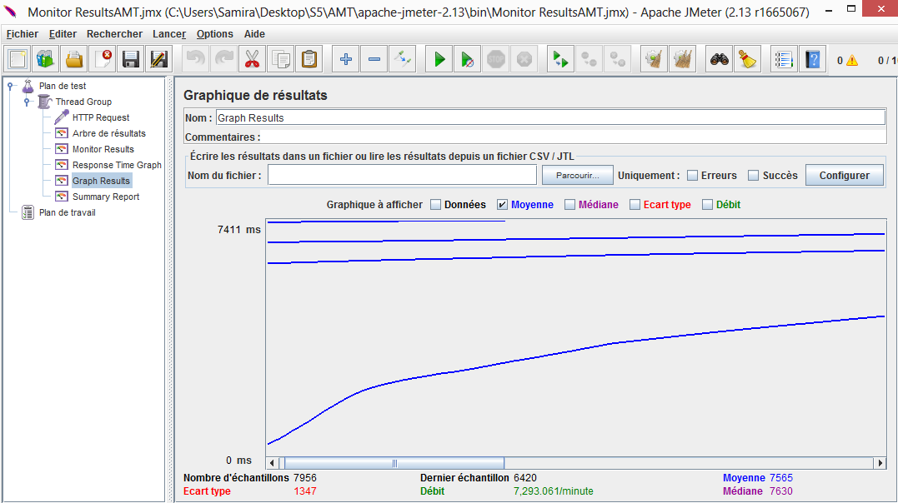
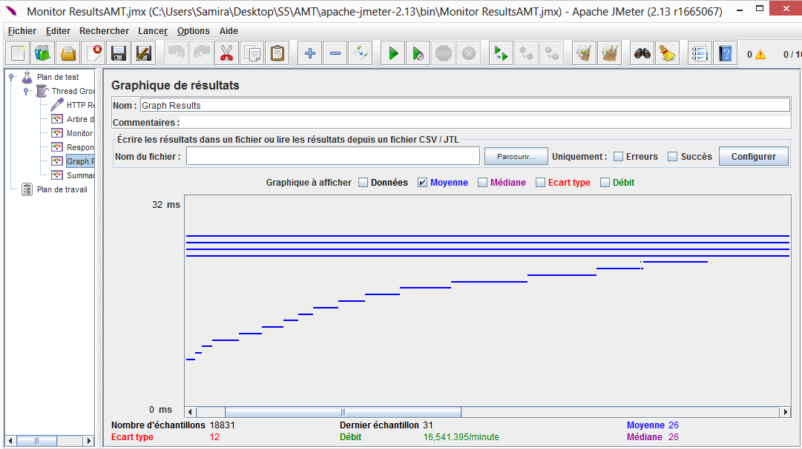
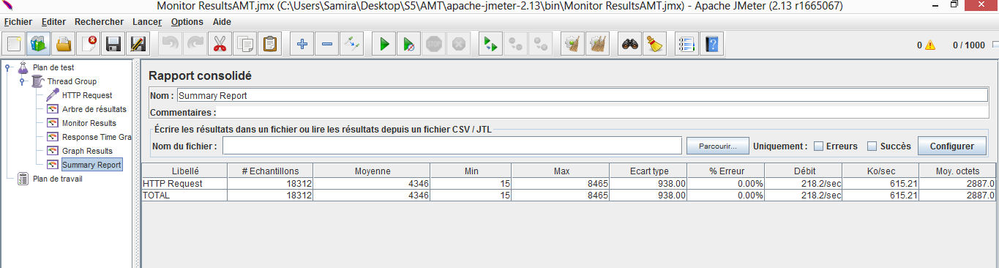
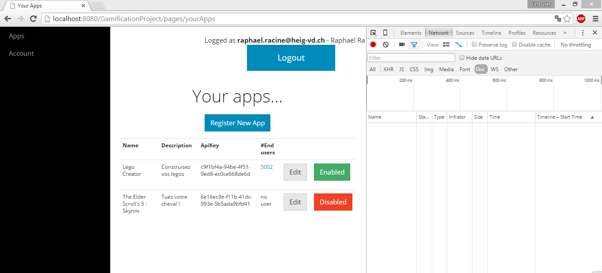
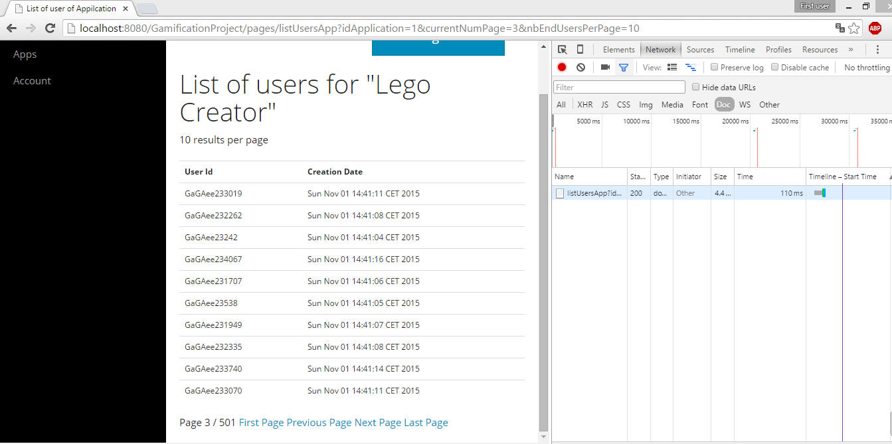

# Project Report

## Administrative information

### Team

Raphaël Racine | raphaelracine | Project Owner - Services et aide servlets

Samira Kouchali | SamiraKouchali | Servlets, filtres et tests JMeter

Vanessa Michelle Meguep Sakam | michellesakam | Vues (UI)

Parfait plaisir de Pâques Noubissi | NOUBISSI | Base de données et modèles

### Tasks realized by the different team members

####Raphaël Racine

26.09.2015

<li> Redéfinir la structure du projet (notamment au niveau des pages)

En collaboration avec Samira Kouchali (les autres ayant un travail en dehors des cours)
<li>Création des vues principales pour le projet (seulement les fichiers jsp)
<li>Création d'un contrôleur (servlet) pour chacune de ces vues
<li>Création d'un contrôleur qui permet le login et le logout (AuthenticationServlet)
<li>Création d'un filtre qui permet de vérifier pour certaines pages qu'il y aie
    un utilisateur connecté

29.09.2015
<li>Scéance de discussion avec les membres du groupe

En collaboration avec Parfait plaisir de Pâques :
<li>Commencement de la réalisation des entités JPA

02.10.2015
<li>Résolution d'un bug lié au manque de la balise <base href="..."> qui posait
des problèmes CSS et des problèmes de redirection

03.10.2015
<li>Création d'un compte possible
<li>Alignement correcte du formulaire du login (sauf le bouton créer un compte)
<li>Début de l'implémentation des services DAO

05.10.2015

En collaboration avec Vanessa :
<li>Affichage du nombre de enduser inscrit les 30 derniers jours (page Welcome)

12.10.2015
<li>Création d'un fichier JSP pour afficher des erreurs (ce fichier est inclus dans header.jsp)

16.10.2015
<li>Avancement de la classe de génération de données de tests pour la persistence (TestDataManager.java)

17.10.2015
<li>Il est maintenant possible de créer une application et de lui assigner un Account, la clé de l'application est générée à ce moment là
<li>Restruction des services au niveau des requêtes SQL (elle ont été déplacées dans les classes modèles pour créer des requêtes nommées)
<li>Implémentation de la création d'une application dans le controleur ApplicationRegistration.java
<li>Reprise des données dans les formulaires en cas d'erreurs de saisie (Application et Account registration)

20.10.2015
<li>Injection des DAO dans les contrôleurs
<li>Utilisation de GenericDAO dans les DAO (en collaboration avec Parfait)
<li>Adaptation des modèles avec la classe AbstractDomainModelEntity (classe de Olivier LIechti) (en collaboration avec Parfait)
<li>Implémentation du POST dans le contrôleur qui permet d'éditer un compte
et adaptation de la vue

23.10.2015
<li>Implémentation d'une méthode dans ApplicationsManager qui permet de lui ajouter un 
end-user
<li>Avancement des JSP (liste des applications de l'utilisateur courant et programmation des boutons)

24.10.2015
<li>Implémentation de la page JSP qui affiche les EndUSers de l'application (controleurs, services) et traitement de la pagination

25.10.2015
<li>Factorisation création compte et modification compte au niveau JSP

27.10.2015
<li>Ecriture du code pour mettre à jour une application et factorisation création application et édition application au niveau JSP

30.10.2015
<li>Mise en place d'une politique de mots de passe pour les comptes utilisateur
<li>Commencement de la documentation pour la partie 1

31.10.2015
<li>Refactoring et commentaires du code

####Samira Kouchali
26.09.2015

En collaboration avec Raphaël Racine 
<li> Redéfinir la structure du projet (notamment au niveau des pages)
<li>Création des vues principales pour le projet (seulement les fichiers jsp)
<li>Création d'un contrôleur (servlet) pour chacune de ces vues
<li>Création d'un contrôleur qui permet le login et le logout (AuthenticationServlet)
<li>Création d'un filtre qui permet de vérifier pour certaines pages qu'il y aie
    un utilisateur connecté

2.10.2015
<li> préparé un scénario simple pour vérifier les performances de l'application avec jmeter

9.10.2015
<li> préparé des tests de sélénium(fluentlénium) pour vérifier la fonctionnalité de la page d'accueil et login de l'application Web

<li> préparé un test de jmeter de comparer le temps de réponse de l'application dans plusieurs cas, en ce qui concerne la mise en œuvre de la "count" dans l'application

16.10.2015

En collaboration avec Raphaël Racine
<li>Avancement de la classe de génération de données de tests pour la persistence (TestDataManager.java)

<li>revoir et comprendre les lectures et les codes qui sont fournis par les autres membres du groupe

23.10.2015
<li> préparé des tests de sélénium(fluentlénium) pour vérifier la fonctionnalitéé de la page create un nouveau compte et create un nouveau l'application 

30.10.2015

<il>comprendre les codes et préparer des tests sur d'autre la fonctionnalité du projet comme edit information du compte et d'application...

<il>écrire le rapport sur la partie du test
 
####Parfait plaisir de Pâques Noubissi
29.09.2015
<li>Scéance de discussion avec les membres du groupe

<li>Commencement de la réalisation des entités JPA
03.10.2015
<li>creation des entités métier et implementation des annotations jpa
<li>Collaboration avec le professeur pour résoudre les bugs sur les annotations jpa

14.10.2015
<li>create et implementation des DTOs

20/21.10.2015
<li>Implementation des DTO de façon générique et collaboration avec racine pour résoudre les bug

26.10.2015
<li>séance de discution sur le sur l'état d'avance du projet 

####Vanessa Michelle Meguep Sakam

25.09.2015
<li> lecture du code du MVC demo

26.09.2015
<li> Création de la vue welcome.jsp sans affichage des données dynamiques(nombre d’accounts create etc.)

29.09.2015
<li>Scéance de discussion avec les membres du groupe
<li> Création de a vue « Registration »

02.10.2015
<li> resolution conflits git
<li> création de la vue «Register new App », « app details »
<li> Séance de discussion avec le prof et les autres membres du groupe

05.10.2015
En collaboration avec raphael:
<li>Affichage du nombre de enduser inscrit les 30 derniers jours (page Welcome)

06.10.2015
<li>Création « edit your “account details” et “your apps”

09.10.2015

<li> lecture du code du project
<li>Modification du code de la vue « register new app » pour l’affichage des champs APIKEY et users
<li> comment créer la barre de navigation verticale.Debut de l’implémentation

13.10.2015
<li> séance de discussion : decision d’introduire des fenêtres modales.
<li> debut de l’implémentation

16.10.2015
<li> code html pourri-> réorganisation du code.Ajout d’un fichier footer.jsp.
<li>soucis avec l’affichage de la fenêtre modale.Application avec la vue « your apps ».Lorsque l’utilisateur appuye sur le bouton register « register new app » celui-ci devrait ouvrir la fenêtre modale « register new app » dont le code de la fenêtre avait déjà été crée. Au lieu de cela, il inclus directement le code de la page « register new app » dans celle de « your app ».

## Introduction

## User Guide

### How to execute and access the application
### How to use the application
### How to update, build and deploy the application
### How to run the automated test procedure

## Design

### System overview
### Gamification features
### User interface
### REST API
### Design patterns

## Implementation

### Package structure
### Selected aspects

## Testing and validation

### Test strategy

Pour tester fonctionnement de l'application web avec fluentlénium: il faut d'aborde lancer et exécuter le projet pour démarrer le serveur, après pour générer les data il faut ajouter "/generate" in url. Maintenant on peut lancer le projet du test.

pour tester le performance du l'application avec jmater il faut faire la même chose. ca vaut dire lancez  le projet et générez les data avec url "/generate". Maintenant on peut commencer le test avec jmeter

Important: il faut lancer le programme du test juste une foie, car la modifications qu'on fait pendant du test , elles restent toujours dans la base de donne. Pour relancer le test il faut relancer l'application aussi afin que les données ne se trouvent plus dans la base de données.

### Tools

Les outils utilisés sont :
<li>JMeter --> Tests de performances (taux d'erreur, temps de réponse, graphiques)
<li>Fluentlenium --> Tests fonctionnels avec navigation automatique sur les pages de l'application
<li>Google Chrome

### Procedures

####Fluentlenium
<b>itShouldNotBePossibleToSigninWithAnInvalidEmail</b>

<b>But:</b> vérifier qu'il n'est pas possible de se loger avec un email invalide.

<b>Etapes :</b>

<li>Accéder à l'URL de base du projet
<li>Vérifier qu'on est sur la page d'acceuil
<li>L'utilisateur essaie de se connecter avec un email invalide et un mot de passe quelconque
<li>L'utilisateur appuie sur Login

<b>Résultat attendu</b> : L'utilisateur ne doit pas pouvoir se connecter et doit rester sur la page d'acceuil

****************************************

<b>itShouldBePossibleToSigninWithAnvalidEmail</b> 

<b>But:</b> qu'il est possible de se loger avec un email valide.

<b>Etapes :</b>

<li>Accéder à l'URL de base du projet
<li>Vérifier qu'on est sur la page d'acceuil
<li>L'utilisateur essaie de se connecter avec un email valide et un mot de passe valide 
<li>L'utilisateur appuie sur Login

<b>Résultat attendu</b> : L'utilisateur doit pouvoir se connecter et accéder à la page "Your Apps"

********************

<b>itShouldBeNotPossibleToAccessSecurePagesWithoutLogin</b>

<b>But:</b> vérifier qu'il n'est pas possible d'acceder a une page securité sans se logger

<b>Etapes :</b>
<li>Accéder diréctement à l'URL de la page sécurisé "Your Apps" 
 

<b>Résultat attendu</b> : L'utilisateur ne doit pas accéder à cette page et doit rester sur la page d'acceuil

***********************************************
<b>itShouldBePossibleToAccessRegistrationPagesWithClickSurCreateAccountButton()</b>

<b>But:</b> vérifier qu'il est possible d'accéder à la page enregistrement d'un compte avec bouton "Create Account" 

<b>Etapes :</b>

<li>Accéder à l'URL de base du projet
<li>L'utilisateur appuie sur CreateAccount

<b>Résultat attendu</b> :L'utilisateur doit accéder à la page enregistrement un account

*********************************************

<b>itShouldNotBePossibleToSignUpWithAnInvalidEmail</b>

<b>But:</b> vérifier qu'il n'est pas possible de s'inscrire(sign up) avec un email invalide

<b>Etapes :</b>
<li>Accéder à l'URL de la page non sécurisée Registration un compte
<li>Vérifier qu'on est sur la page enregistrement
<li>L'utilisateur essaie de créer un compte avec un email invalide 
<li>L'utilisateur appuie sur Sign Up

<b>Résultat attendu</b> :L'utilisateur doit pas accéder à la page "Your Apps" et doit rester sur la page enregistrement d'un compte

***********************************************

<b>itShouldNotBePossibleToSignUpWithAnPasswordSmallerThan8Character</b>

<b>But:</b> vérifier qu'il n'est pas possible de s'inscrire(sign up) avec un mot de passe plus petit que huit caractère

<b>Etapes :</b>
<li>Accéder à l'URL de la page non sécurisée enregistrement d'un compte
<li>Vérifier qu'on est sur la page enregistrement
<li>L'utilisateur essaie de créer un compte avec un mot de passe qui est plus petit que huit caractère
<li>L'utilisateur appuie sur Sign Up

<b>Résultat attendu</b> :L'utilisateur doit pas accéder à la page "Your Apps" et doit rester sur la page enregistrement d'un compte Car le mot de passe doit être égale ou plus grand que huit.

*******************************************************

<b>itShouldNotBePossibleToSignUpIfThePasswordAndConfirmPasswordAreNotIdentical</b>

<b>But:</b>vérifier qu'il n'est possible à créer un compte si le mot de passe et sa confirmation ne sont pas identique.

<b>Etapes :</b>
<li>Accéder à l'URL de la page non sécurisée enregistrement d'un compte
<li>Vérifier qu'on est sur la page enregistrement
<li>L'utilisateur essaie d'entrer un mot de passe et sa confirmation qui ne sont pas identique 
<li>L'utilisateur appuie sur Sign Up

<b>Résultat attendu</b>  L'utilisateur doit rester sur la page enregistrement d'un compte avec une erreur

*******************************

<b>itShouldBePossibleToAccessYourAppsPagesWithCreateAnAccount</b> 

<b>But:</b> vérifier qu'il est possible d'accéder à la page "Your Apps" aves créer un compte juste

<b>Etapes :</b>
<li>Accéder à l'URL de la page non sécurisée enregistrement d'un compte
<li>Vérifier qu'on est sur la page enregistrement
<li>L'utilisateur essaie de créer un compte avec les informations  qui sont nécessaire  
<li>L'utilisateur appuie sur Sign Up

<b>Résultat attendu</b> :L'utilisateur doit accéder à la page "Your Apps"

****************************************************

<b>itShouldNotBePossibleToCreateAnAccountWithEmailWhitchAlreadyExists</b>

<b>But:</b>vérifier que l'adresse email est unique et on arrive pas de créer un compte avec email qui est existe déjà

<b>Etapes :</b>
<li>Accéder à l'URL de la page non sécurisée enregistrement d'un compte
<li>Vérifier qu'on est sur la page enregistrement
<li>L'utilisateur essaie de créer un compte avec un adresse email qui existe déjà et n'est pas unique
<li>L'utilisateur appuie sur Sign Up

<b>Résultat attendu</b> :L'utilisateur doit rester sur la page enregistrement d'un compte avec l'erreur

***********************
<b>itShouldAllowTheUsersToRegisterNewApplication()</b>

<b>But:</b>vérifier que application permettre aux utilisateurs d'enregistrer une nouvelle application

<b>Etapes :</b>
<li>L'utilisateur se connecte avec un email et un mot de passe qui sont valides
<li>L'utilisateur appuie sur Register New App

<b>Résultat attendu</b>L'utilisateur doit accéder à la page enregistrement nouvelle application

***********************

<b>itShouldBePossibleToRegisterNewAppWithSubmitNecessaryInformations</b>

<b>But:</b>vérifier qu'il est possible de créer une nouvelle application avec les informations nécessaire

<b>Etapes :</b>
<li>L'utilisateur se connecte avec un email et un mot de passe qui sont valides
<li>L'utilisateur appuie sur Register New App
<li>L'utilisateur essaie d'entrer le nom et la description de nouvelle application
<li>L'utilisateur appuie sur Register

<b>Résultat attendu</b>L'utilisateur doit voir la nouvelle application dans la page "Your Apps"

*************************
<b>itShouldNotBePossibleToRegisterAnApplicationWhitchAlreadyExists</b>

<b>But:</b> vérifier qu'il n'est possible de créer une nouvelle application qui existe déjà

<b>Etapes :</b>
<li>L'utilisateur se connecte avec un email et un mot de passe qui sont valides
<li>L'utilisateur appuie sur Register New App
<li>L'utilisateur essaie d'entrer le nom d'application qui existe déja et n'est pas unique
<li>L'utilisateur appuie sur Register

<b>Résultat attendu</b>L'utilisateur doit rester sur la page enregistrement l'application avec une erreur

*************************
<b>itShouldBePossibleToEditTheNameOfApplicationByClickEditButton</b>

<b>But:</b> vérifier qu'il est possible d' editer le nom d'application 

<b>Etapes :</b>

<li>L'utilisateur se connecte avec un email et un mot de passe qui sont valides
<li>L'utilisateur appuie sur le bouton Edit d'un application
<li>Vérifier qu'on est sur la page App details 
<li>L'utilisateur essaie de changer le nom d'application
<li>L'utilisateur appuie sur Register
<li>Vérifier qu'on est sur la page Your Apps 

<b>Résultat attendu</b>L'utilisateur doit voir la modification qu'il a fait sur le nom d'application

***********************

<b>itShouldBePossibleToEditTheNameOfApplicationByClickEditButton</b>

<b>But:</b> vérifier qu'il est possible d'editer la description d'application 

<b>Etapes :</b>

<li>L'utilisateur se connecte avec un email et un mot de passe qui sont valides
<li>L'utilisateur appuie sur le bouton Edit d'un application
<li>Vérifier qu'on est sur la page App details 
<li>L'utilisateur essaie de changer la description d'application
<li>L'utilisateur appuie sur Register
<li>Vérifier qu'on est sur la page Your Apps 

<b>Résultat attendu</b>L'utilisateur doit voir la modification qu'il a fait sur la modification d'application

***********************

<b>itShouldBePossibleToNotSaveTheEditionInTheNamePartByClickCancelButton</b>

<b>But:</b> vérifier qu'il n'est possible de sauvegarder la modification sur le nom d'application avec le bouton Cancel 

<b>Etapes :</b>

<li>L'utilisateur se connecte avec un email et un mot de passe qui sont valides
<li>L'utilisateur appuie sur le bouton Edit d'un application
<li>Vérifier qu'on est sur la page App details 
<li>L'utilisateur essaie de changer le nom d'application
<li>L'utilisateur appuie sur Cancel
<li>Vérifier qu'on est sur la page Your Apps

<b>Résultat attendu</b> La modification qui a fait par utilisateur n'est pas sauvegardé 

***********************
<b>itShouldBePossibleToNotSaveTheEditionInTheDescriptionPartByClickCancelButton</b>

<b>But:</b> vérifier qu'il n'est possible de sauvegarder la modification sur la description d'application avec le bouton Cancel 

<b>Etapes :</b>

<li>L'utilisateur se connecte avec un email et un mot de passe qui sont valides
<li>L'utilisateur appuie sur le bouton Edit d'un application
<li>Vérifier qu'on est sur la page App details 
<li>L'utilisateur essaie de changer la description d'application
<li>L'utilisateur appuie sur Cancel
<li>Vérifier qu'on est sur la page Your Apps

<b>Résultat attendu</b> La modification qui a fait par utilisateur n'est pas sauvegardé 

**********************
<b>itShouldBePossibleForUserToEditHisAccount</b>

<b>But:</b> vérifier que utilisateur est capable de Editer son compte 

<b>Etapes :</b>
<li>L'utilisateur se connecte avec un email et un mot de passe qui sont valides
<li>L'utilisateur appuie sur le Account 
<li>Vérifier qu'on est sur la page Edit Account 
<li>L'utilisateur essaie de changer le mot de passe et il le répète pour partie confirmation
<li>L'utilisateur appuie sur le Confirm
<li>L'utilisateur appuie sur le Logout
<li>Vérifier qu'on est sur la page d'accueil 
<li>L'utilisateur essaie de se connecter avec l'email et le nouveux mot de passe 
<li>L'utilisateur appuie sur le Login

<b>Résultat attendu</b> L'utilisateur doit arrive à se connecter et accéder à la page Your Apps

**********************

<b>itShouldNotBeSaveTheEditionOnAccountByTheUserUserByClickCancelButton</b>

<b>But:</b> vérifier qu'il n'est possible de sauvegarder la modification sur la page Edit Account avec le bouton Cancel  

<b>Etapes :</b>
<li>L'utilisateur se connecte avec un email et un mot de passe qui sont valides
<li>L'utilisateur appuie sur le Account 
<li>Vérifier qu'on est sur la page Edit Account 
<li>L'utilisateur essaie de changer le mot de passe et il le répète pour partie confirmation
<li>L'utilisateur appuie sur le Cancel
<li>L'utilisateur appuie sur le Logout
<li>Vérifier qu'on est sur la page d'accueil 
<li>L'utilisateur essaie de se connecter avec l'email et le nouveux mot de passe 
<li>L'utilisateur appuie sur le Login

<b>Résultat attendu</b> L'utilisateur ne doit pas se connecter et rester sur la page d'accueil 

**********************************

<b>itShouldBePossibleToAccessYourAppByClickApp</b>

<b>But:</b> vérifier que utilisateur peut accéder a la page Your Apps avec appuyer sur Apps 

<b>Etapes :</b>
<li>L'utilisateur se connecte avec un email et un mot de passe qui sont valides
<li>L'utilisateur appuie sur le Edit d'un application
<li>Vérifier qu'on est sur la page Edit Account 
<li>L'utilisateur appuie sur le Apps 

<b>Résultat attendu</b> L'utilisateur doit accéder à la page Your Apps

********************************
<b>itShouldBePossibleToAccessTheListOfUserOfApplication</b>

<b>But:</b> vérifier qu'il est possible d'accéder à la page List de utilisateurs d'un application

<b>Etapes :</b>
<li>L'utilisateur se connecte avec un email et un mot de passe qui sont valides
<li>L'utilisateur appuie sur le nombre des utilisateurs d'un application

<b>Résultat attendu</b> Utilisateur doit voir le List des utilisateurs d'application
 
*********************************

<b>itShouldBePossibleToLogoutWithClickLogoutButton</b>
<b>But:</b> vérifier qu'il est possible de se déconnecter avec le bouton Logout
<li>L'utilisateur appuie sur le Logout

<b>Résultat attendu</b>L'utilisateur doit se déconnecter et aller à la page d'accueil

*******************************

###Jmeter

JMeter est un projet de logiciel libre permettant d'effectuer des tests de performance d'applications.
pour commencer il faut démarrer le serveur  et générée le data avec url "/generate"

####Test1
<b>But:</b> Le but de la Première scénario de test est de mesurer de  performance de la page d'accueil, on test pour vérifier que
est-ce que on arrive a envoyer les requête sur application et si oui c'est quoi le temps de réponse  et est-ce que il y a les erreur?
 
On vaut mesurer la performance  si il y avait plusieurs utilisateur qui veulent accéder à la page d'accueil en même temps.

A cet effet,  il faut préparer le Jmeter:
<li>1.créer une group d'unités et  définir le nombre d'utilisateurs , durée de montée en charge et nombre d'itérations

<li>2.Ajouter l'échantillon Requête HTTP pour envoyer les requête  HTTP et donner l'URL d'application  

<li>3.Ajouter les récepteurs pour voir les résultat de test comme :
Graphique de résultats , Arbre de résultats, Graphique évolution temps de réponses,...

maintenant tout est prête on peut lancer le test. On voit qu'on arrive à envoyer les requête et on a reçu les réponses.

Maintenant on augment le nombre de compte à 1000 et nombre de user à 500 dans la base de donne d'application et on essaie de tester cette foie avec 500 utilisateur avec le nombre itération infinie pour vérofier le temps de réponses d'application sous la charge. On lance le test et voici les résultat:

**Le temps de Réponse***

**rapport sommaire***

<li>Maintenant on répète le test pour 1000 utilisateur:

**Le tempe de Réponse***

**rapport sommaire***

### Conclusion

Comme illustré dans le "summary report", il n'y a pas d'erreur dans le processus. Dans les résultats, on peut voir que le temps de la réponse augmente de façon significative en augmentant le nombre des utilisateurs. Par exemple, le temps de réponse en cas de 500 utilisateurs est d'environ 3 ms alors qu'il est d'environ 6 ms en cas de 1000 utilisateurs. Par conséquent, nous pouvons conclure que la scalabilité de l'application n'est pas très bon.

####Test2
<b>But:</b>
Le but de ce test est d'évaluer l'effet de la "query" sur la performance de l'application.

Dans la page d'accueil, il est possible de voir le nombre de comptes, les utilisateurs et les applications qui sont existantes dans la base de données. En fait, «service DAO» fournit toutes ces informations sur la page JSP. Pour compter le nombre de comptes, nous avons appliqué les "queries" suivantes:

query 1 = "SELECT * FROM Account a"

query 2 = "SELECT COUNT(a) FROM Account a"

Puis nous avons évalué l'effet de ces requêtes sur la performance de l'application. avec 10 et 1000 utilisateurs.

### Results query 1

####Pour 10 utilisateur

**Grafique du résultats***

**Temps du réponse***

####Pour 1000 utilisateur
**Grafique du résultats***

**Temps du réponse**

**Summary Report***

### Results query 2

####Pour 10 utilisateur
**Grafique du résultats***

**Temps du réponse***

**Summary Report***

####Pour 1000 utilisateur
**Grafique du résultats***

**Temps du réponse***

**Summary Report***

### Conclusion

Comme présenté dans la section des résultats, le temps de réponse en cas de "select *" est environ deux fois plus grande que le cas "SELECT COUNT". Cette conclusion est plus clair lorsque l'application est sous une charge lourde. Par exemple, dans le cas de 1000 utilisateurs, le temps de reponse de "SELECT*" est d'environ 8 ms tandis que le temps de "select count" de réponse est d'environ 4 ms. Par conséquent, il peut être conclu que nous devrions utiliser la méthode optimisée pour améliorer les performances de l'application.

####Test3
<b>But:</b>
Le but de ce test est de tester les performances de pagination lorsque l'on affiche les utilisateurs finaux d'une application.

En effet il est important de le tester car si la pagination ne se ferait pas directement dans le moteur de la base de données, l'application serait beaucoup moins performantecar il faudrait transfers 10000 utilisateurs finaux vers le serveur Glassfish dans le cas où on aurait paginé la liste en Java.

Le but de ce test est donc de montrer que comme la pagination se fait directement dans la base de données et pas en Java, c'est plus performant.

Comme nous n'avons pas réussi à exécuter ce test avec JMeter, à cause de problèmes de login, nous avons choisi de simuler un seul utilisateur qui se connecte au site (qui contient 5000 utilisateurs finaux dans la même application).

Nous avons donc tester le temps de réponse avec l'outil de développement de Google Chrome et nous avons obtenu le résultat suivant :

### Conclusion
On voit que le temps de réponse est très rapide malgré qu'il ait 5000 utilisateurs finaux dans la base de données.

Si on aurait fait la pagination en Java, cela aurait pris beaucoup plus de temps car il aurait fallu transférer 5000 utilisateurs finaux dans le serveur glassfish et ensuite dans l'application pour pouvoir les paginer, alors qu'il suffit que la base de données transfère seulement le contenu nécessaire à afficher dans la page.

## Problèmes connus

## Conclusion
###Partie 1
###Partie 2
###Partie 3

## Auto Evaluation
Le fichier d'auto-évaluation se trouve [ici](evaluation/evaluation.xlsx)

